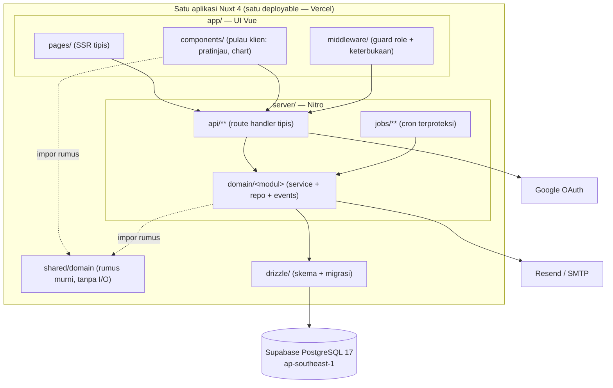
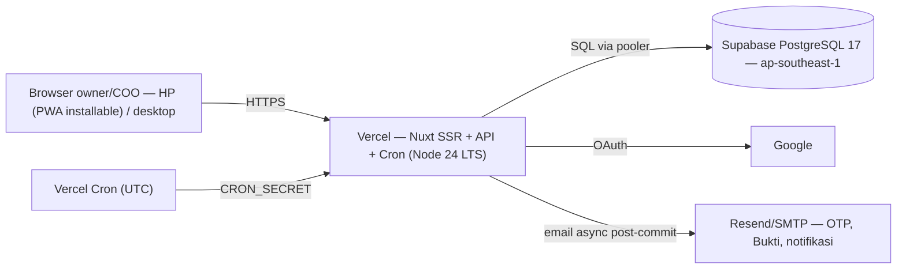

# Design Document: Sip & Dip Ownership Dashboard (Phase 1) — `snd-dashboard-app`

> Design artifacts: **High-Level (Diagrams & Interfaces)** + **Low-Level (Code-First)** combined.
> Language: **TypeScript** (Nuxt 4 / Vue 3 + Nitro). Money/ratio arithmetic uses a pinned decimal library in `shared/domain`.
> This design is derived from and MUST remain consistent with:
> - PRD — #[[file:_bmad-output/planning-artifacts/prds/prd-snd-dash-2026-08-14/prd.md]]
> - Architecture Spine — #[[file:_bmad-output/planning-artifacts/architecture/architecture-snd-dash-2026-09-15/ARCHITECTURE-SPINE.md]]
> - UX Design — #[[file:_bmad-output/planning-artifacts/ux-designs/ux-snd-dash-2026-09-15/DESIGN.md]]
> - UX Experience — #[[file:_bmad-output/planning-artifacts/ux-designs/ux-snd-dash-2026-09-15/EXPERIENCE.md]]
>
> Where the artifacts above specify a rule (FR-n, AD-n, glossary term, mockup), this document references it rather than duplicating it. **The Architecture Spine wins over mockups on conflict; the PRD Glossary wins on terminology.**

---

## Overview

Sip & Dip Ownership Dashboard adalah **satu aplikasi Nuxt 4** (satu folder, satu repo, satu deployable di Vercel) yang menjadi satu sumber kebenaran kepemilikan cafe untuk 22–40 owner. Frontend Vue SSR + pulau klien hidup di `app/`; backend Nitro (API routes, modul domain, cron) hidup di `server/`; rumus domain murni yang dibagikan keduanya hidup di `shared/domain`; skema & migrasi DB hidup di `drizzle/`. Ini **bukan** dua proyek frontend/backend terpisah dan **bukan** dua server.

Inti sistem adalah **ledger append-only** (AD-1): `ledger_transactions` adalah satu-satunya penulis posisi kepemilikan; seluruh tampilan (tabel kepemilikan FR-4, chart FR-18, Portion, Strength, RKAP Fulfillment) adalah **proyeksi** turunannya. Setiap penulisan multi-tabel terjadi dalam satu transaksi DB atomik dengan pengambilan lock berurutan global dan transisi status compare-and-set (AD-2). Semua aritmetika uang/rasio terpusat di `shared/domain` (AD-6, AD-10) sehingga pratinjau klien dan validasi server tidak pernah berbeda hasil.

Aplikasi berjalan sebagai web responsif dua-postur (mobile `<lg` dominan owner, desktop `≥lg` alur berat COO) dengan PWA installable yang **hanya** men-cache aset statis — seluruh data domain selalu daring (AD-12). UI dalam Bahasa Indonesia; istilah metrik tetap English verbatim per Glossary PRD §3.

---

# PART A — HIGH-LEVEL DESIGN (Diagrams & Interfaces)

## Architecture

### A.1 Layer map (single Nuxt application)



Flow data (paradigma spine): `app/ (SSR + pulau) → server/api (tipis) → server/domain (modul) → Drizzle → PostgreSQL`. `shared/domain` dipakai bersama oleh `server/domain` (validasi otoritatif) dan pulau pratinjau/chart (display). **Server tetap satu-satunya otoritas keputusan** (AD-6).

### A.2 Module dependency direction

Modul domain dan arah dependensinya mengikuti AD-5 verbatim. Ringkas: `PESANAN`, `DASHBOARD`, `DISTRIBUSI` membaca proyeksi `LEDGER`; hanya `LEDGER` menulis posisi; `IDENTITAS` satu-satunya penulis status owner (AD-11); semua modul menulis (never read for business) ke `AUDIT` (AD-3); `PROOFS` bereaksi post-commit via outbox (AD-5). Diagram kanonik: lihat AD-5 di Architecture Spine.

Sepuluh modul domain (`server/domain/<modul>`): `identity`, `orders`, `ledger`, `rkap`, `pricing`, `contribution`, `distribution`, `proofs`, `audit`, `migration`. Setiap modul mengekspos **hanya** `index.ts` sebagai pintu impor lintas modul (AD-5).

### A.3 Deployment topology



Lingkungan: `local` (Supabase CLI/Docker) + `production` saja (AD-9). Cron harian memanggil endpoint terproteksi; batas hari dihitung di dalam endpoint memakai zona **Asia/Jakarta**, bukan jam trigger UTC.

## Components and Interfaces

Setiap modul domain berbentuk `index.ts` (pintu publik) + `*.service.ts` (orkestrasi transaksi) + `*.repo.ts` (satu-satunya query Drizzle tabel milik modul) + `events.ts` (event yang dipancarkan). Fungsi yang berpartisipasi dalam transaksi lintas modul menerima handle `tx` (AD-2/AD-5); hanya service teratas membuka transaksi.

Kepemilikan tabel per modul (AD-5):

| Modul | Tabel milik | Governed by |
|---|---|---|
| `identity` | `owners`, `profiles`, `roles`, `coo_tenures`, `otp_codes` | AD-8, AD-11 |
| `orders` | `buy_orders` | AD-2, AD-7 |
| `ledger` | `ledger_transactions`, `positions` | AD-1, AD-2, AD-4 |
| `rkap` | `rkap_phases`, `capital_items` | AD-2, AD-6, AD-7 |
| `pricing` | `price_periods`, `moms` | AD-7 |
| `contribution` | `contribution_items`, `contribution_entries`, `contribution_periods` | AD-5, AD-10 |
| `distribution` | `profit_distributions`, `profit_distribution_lines` | AD-6, AD-10, AD-11 |
| `proofs` | `email_outbox` | AD-5 (post-commit, outbox) |
| `audit` | `audit_logs` | AD-3 |
| `migration` | (tanpa tabel; memakai API internal LEDGER) | AD-1, konvensi Migrasi |

### A.4 Public module interfaces (cross-module doors)

```typescript
// server/domain/identity/index.ts
export interface IdentityModule {
  // Lifecycle & access (AD-8, AD-11) — satu fungsi kanonik atas status siklus hidup
  aksesPenuh(owner: OwnerLifecycle): boolean
  perluReferral(owner: OwnerLifecycle): boolean
  pilihanReferral(tx: Tx): Promise<ReferralChoice[]> // pemegang saham atau owner belum pernah beli
  requireVerifiedProfile(tx: Tx, ownerId: Uuid): Promise<void> // re-validasi kelengkapan Profile in-tx

  // Status transitions — compare-and-set atas status sebelumnya (AD-11)
  submitRegistration(googleEmail: string): Promise<Owner>          // → 'diajukan' (unique per email; re-daftar = CAS kedaluwarsa→diajukan)
  verifyRegistration(tx: Tx, ownerId: Uuid, cooId: Uuid): Promise<void> // 'diajukan' → 'terverifikasi'
  rejectRegistration(tx: Tx, ownerId: Uuid, cooId: Uuid, reason: string): Promise<void>
  markFirstPurchaseEffective(tx: Tx, ownerId: Uuid, at: Date): Promise<void> // set first_effective_at (event Pembelian Pertama)
  markExit(tx: Tx, ownerId: Uuid): Promise<void> // 'keluar' — re-validasi positions.shares = 0 in-tx

  // COO authority (AD-8) — dicek DI DALAM transaksi finalisasi
  assertCooAt(tx: Tx, userId: Uuid, at: Date): Promise<CooTenure>
  transferCoo(tx: Tx, fromCoo: Uuid, toOwner: Uuid, momRef: Uuid): Promise<void> // FR-17

  // MFA (FR-3, AD-8) — verifikasi & konsumsi DI DALAM tx finalisasi
  requestOtp(actionType: MfaActionType, targetRef: Uuid, cooId: Uuid): Promise<void> // invalidasi kode hidup sebelumnya
  verifyAndConsumeOtp(tx: Tx, actionType: MfaActionType, targetRef: Uuid, code: string): Promise<void>
}

// server/domain/orders/index.ts
export interface OrdersModule {
  previewCalculation(input: OrderPreviewInput, ctx: PreviewContext): OrderPreview // via shared/domain — sama dengan validasi
  submitOrder(input: SubmitOrderInput): Promise<BuyOrder>       // validasi Strength (FR-1); tolak = tanpa baris pesanan (audit saja)
  withdrawOrder(ownerId: Uuid, orderId: Uuid): Promise<void>    // CAS: menunggu_konfirmasi & withdrawn_at IS NULL → set withdrawn_at
  listQueueForCoo(): Promise<QueueRow[]>                        // seluruh pending (COO)
  listMyOrders(ownerId: Uuid): Promise<BuyOrder[]>             // hanya milik owner
  expirePendingOrders(tx: Tx, jakartaToday: JakartaDate): Promise<Uuid[]> // cron hari-7 (FR-19)
}

// server/domain/ledger/index.ts — SATU-SATUNYA penulis posisi (AD-1)
export interface LedgerModule {
  // Dua pintu finalisasi + jalur import migrasi memakai API internal ini
  confirmOrder(input: ConfirmOrderInput): Promise<LedgerTransaction>       // FR-20 (via buy_order)
  directEntry(input: DirectEntryInput): Promise<LedgerTransaction>         // FR-21 (tanpa buy_order)
  compensationEntry(input: CompensationInput): Promise<LedgerTransaction>  // AD-1 varian input langsung; TANPA re-validasi gerbang
  importHistorical(tx: Tx, rows: MigrationRow[]): Promise<void>            // FR-14; TANPA gerbang & penyesuaian instant

  // Read-only proyeksi (dipakai lintas modul)
  getPositions(tx?: Tx): Promise<Position[]>
  getOwnerPosition(ownerId: Uuid, tx?: Tx): Promise<Position>
  recomputeFromLedger(): Promise<ReconReport> // alat rekonsiliasi — pembanding, BUKAN jalur tulis (AD-4)
}

// server/domain/rkap/index.ts
export interface RkapModule {
  getPhaseView(phaseId?: Uuid): Promise<RkapPhaseView> // FR-23 tabel + agregat + ringkasan batas + Quantity Left
  spaceByCapitalType(tx: Tx, phaseId: Uuid): Promise<Record<CapitalType, MoneyString>> // Σ Final Requirement − Fulfillment (efektif saja)
  plotAllocation(tx: Tx, ledgerTxId: Uuid, plan: PlottingPlan): Promise<void> // FIFO default; dipanggil dari finalisasi ledger
  applyInstantAdjustment(tx: Tx, capitalItemId: Uuid, overshoot: MoneyString): Promise<void> // otomatis (FR-1/FR-23)
  manualAdjust(tx: Tx, cooId: Uuid, adjustment: ManualAdjustment): Promise<void> // naikkan Final Req / item baru
  rebalance(tx: Tx, cooId: Uuid, plan: RebalancePlan, momRef: Uuid): Promise<void> // antar item sejenis
  newPhase(cooId: Uuid, phase: NewPhaseInput, momRef: Uuid): Promise<RkapPhase>
}

// server/domain/pricing/index.ts
export interface PricingModule {
  currentPrice(kind: PriceKind, onJakartaDate: JakartaDate): Promise<PricePeriod> // resolusi tepat SATU baris (AD-7)
  priceHistory(kind: PriceKind): Promise<PricePeriod[]>
  setPrice(cooId: Uuid, input: SetPriceInput, momRef: Uuid): Promise<PricePeriod> // unique (kind, effective_date)
  saveMom(cooId: Uuid, mom: MomInput): Promise<Mom> // FR-7 draft → final
}

// server/domain/contribution/index.ts
export interface ContributionModule {
  defineItem(cooId: Uuid, item: ContributionItemInput, momRef: Uuid): Promise<ContributionItem> // FR-8
  recordRealization(cooId: Uuid, entry: RealizationInput): Promise<ContributionEntry>            // FR-9; tolak jika periode final
  runningPoints(ownerId: Uuid): Promise<PointsView>                                              // poin berjalan + carry-over
  cutOff(tx: Tx, cooId: Uuid, cutOffJakartaDate: JakartaDate): Promise<CutOffRecap>              // FR-10; snapshot beku imutabel
  finalizedUnredeemedPoints(tx: Tx): Promise<OwnerPoints[]>                                      // basis Insentif (AD-10)
}

// server/domain/distribution/index.ts
export interface DistributionModule {
  simulate(input: DistributionInput): DistributionRecap // FR-16 via shared/domain (tanpa persist)
  saveRecap(tx: Tx, cooId: Uuid, input: DistributionInput): Promise<ProfitDistribution> // snapshot imutabel; tandai tertunaikan + flip Keluar
  compareToPrevious(recapId: Uuid): Promise<RecapComparison>
}

// server/domain/proofs/index.ts
export interface ProofsModule {
  enqueueProof(tx: Tx, ledgerTxId: Uuid): Promise<void>   // baris outbox DI DALAM tx aksi (AD-5)
  enqueueEmail(tx: Tx, email: OutboundEmail): Promise<void> // OTP tidak lewat sini (sync-ish); notifikasi & Bukti lewat sini
  renderProofPdf(ledgerTxId: Uuid): Promise<Uint8Array>   // fungsi murni state ledger pada titik potong (regenerate-on-demand)
  drainOutbox(): Promise<void>                            // async + retry; kegagalan terus-menerus wajib terlihat (log+alert)
}

// server/domain/audit/index.ts — append-only (AD-3)
export interface AuditModule {
  write(tx: Tx, entry: AuditEntry): Promise<void> // { actor, action(enum registry), target, details jsonb } — SELALU in-tx
  listForCoo(filter: AuditFilter): Promise<AuditLog[]> // pembacaan hanya tampilan COO
}

// server/domain/migration/index.ts — FR-14
export interface MigrationModule {
  run(source: MigrationSource): Promise<MigrationReport> // memakai LedgerModule.importHistorical; aktor 'system'
}
```

## Data Models

Semua tipe kawat uang/rasio melewati batas API/SSR sebagai **string desimal berskala tetap** (AD-10). `MoneyString`, `RatioString` adalah branded string; `Number()`/`parseFloat()` atas nilai ini dilarang di semua lapisan.

```typescript
// shared/domain/types.ts
export type Uuid = string & { readonly __brand: 'Uuid' }
export type MoneyString = string & { readonly __brand: 'Money' }   // numeric(18,2) di DB
export type RatioString = string & { readonly __brand: 'Ratio' }   // numeric(9,6) di DB, half-up 2 desimal saat display
export type JakartaDate = string & { readonly __brand: 'JakartaDate' } // 'YYYY-MM-DD' zona Asia/Jakarta

export type CapitalType = 'Modal Tetap' | 'Modal Bergerak' | 'Modal Operasional' // nilai selalu Bahasa Indonesia
export type OrderStatus = 'menunggu_konfirmasi' | 'terkonfirmasi' | 'ditolak' | 'kedaluwarsa'
export type OwnerLifecycle = 'diajukan' | 'terverifikasi' | 'ditolak' | 'kedaluwarsa' | 'keluar'
export type PriceKind = 'beli' | 'jual' // 'jual' tercatat untuk Phase 2, tidak dipakai transaksi Phase 1
export type MfaActionType = 'konfirmasi' | 'input_langsung' | 'kompensasi' // himpunan tertutup MFA (AD-8)

export const CAPITAL_RULES: Record<CapitalType, { plafon: number; bobot: number; inRkap: boolean }> = {
  'Modal Tetap':       { plafon: 5, bobot: 1, inRkap: true },
  'Modal Bergerak':    { plafon: 3, bobot: 2, inRkap: true },
  'Modal Operasional': { plafon: 1, bobot: 3, inRkap: false },
}
```

### Core entity relationships

Entity relationships dan atribut-invariant mengikuti ER diagram di Architecture Spine (Structural Seed). Ringkas: `owners` 1—* `buy_orders`/`ledger_transactions`/`positions`/`contribution_entries`; `buy_orders` *—1 `price_periods` (Harga Terkunci, disimpan sebagai nilai) & *—o1 `owners` (referral); `ledger_transactions` *—o1 `buy_orders` (NULL untuk input langsung & migrasi), *—o1 `capital_items` (plotting), *—1 `price_periods` (harga final, disimpan sebagai nilai); `rkap_phases` 1—* `capital_items`; `moms` 1—* `price_periods`/`contribution_items`; `profit_distributions` 1—* `profit_distribution_lines`.

### Representative model interfaces

```typescript
// server/domain/ledger/ledger.model.ts
export interface LedgerTransaction {
  id: Uuid
  ownerId: Uuid
  capitalType: CapitalType
  quantity: number                 // integer
  shares: number                   // integer = quantity × bobot
  ceil: number                     // integer = quantity × plafon
  finalPrice: MoneyString          // nilai ter-snapshot (bukan FK-resolve) — AD-7
  finalPriceRef: Uuid              // FK price_periods (baris asal saja)
  actualAmount: MoneyString        // dana riil disetor
  buyOrderId: Uuid | null          // NULL: input langsung / migrasi
  capitalItemId: Uuid | null       // plotting (Tetap/Bergerak); NULL Operasional
  paymentDate: JakartaDate
  paymentMethod: string            // 'migrasi' bila historis tak diketahui
  compensationOfId: Uuid | null    // AD-1 entry kompensasi menunjuk baris asal
  actor: 'user' | 'system'
  effectiveAt: Date                // timestamptz UTC
}

export interface Position { // proyeksi AD-4 — tabel biasa dipelihara in-tx append ledger
  ownerId: Uuid
  quantityByType: Record<CapitalType, number>
  sharesByType: Record<CapitalType, number>
  ceilByType: Record<CapitalType, number>
  actualByType: Record<CapitalType, MoneyString>
}

// server/domain/orders/orders.model.ts
export interface BuyOrder {
  id: Uuid
  ownerId: Uuid
  capitalType: CapitalType
  quantity: number
  lockedPrice: MoneyString         // Harga Terkunci disimpan sebagai nilai (AD-7)
  lockedPriceRef: Uuid
  referralOwnerId: Uuid | null     // wajib s.d. Pembelian Pertama efektif (FR-22)
  status: OrderStatus
  withdrawnAt: Date | null         // penarikan = kolom, bukan status (AD-2)
  submittedAt: Date
  // pending kanonik: status = 'menunggu_konfirmasi' AND withdrawn_at IS NULL
}
```

**Validation rules** (enforced di `shared/domain` + repo, bukan di komponen):
- Strength owner setelah transaksi ≤ 100% (FR-1); Strength = Σ Shares owner ÷ Σ Ceil owner.
- Uang `numeric(18,2)`; Quantity/Shares/Ceil/bobot/plafon integer; rasio `numeric(9,6)`, half-up 2 desimal saat display (AD-10, NFR §4.8).
- `owners` unik per email; `price_periods` unik per `(kind, effective_date)` (AD-7).
- Semua guard status pesanan wajib memuat `AND withdrawn_at IS NULL` (AD-2).

## Error Handling

Bentuk error API seragam: `{ code, message, details }` (konvensi Data & format). Penolakan terhitung membawa angka lengkap (font-mono di UI) — tidak pernah generik (EXPERIENCE.md `Alert Penolakan Terhitung`).

| Skenario | Kondisi | Respons | Pemulihan |
|---|---|---|---|
| Strength > 100% saat submit | FR-1 gagal | Tolak **tanpa baris pesanan** (audit saja); `Alert Penolakan Terhitung` dengan proyeksi Ceil/Shares/Strength + opsi | Owner kurangi Quantity atau beli Modal Tetap/Bergerak dulu |
| Re-validasi gagal saat konfirmasi | Posisi/ruang RKAP berubah (FR-20) | Pesanan → `ditolak` + hitungan; saran alih ke Modal Operasional atau refund (kanal luar) | COO catat resolusi di audit trail |
| Race ruang RKAP terakhir | Dua konfirmasi bersaing (AD-2) | First-confirm wins; yang kalah re-validasi gagal → `ditolak` | Owner beli Operasional / MRO berikutnya |
| OTP salah/kedaluwarsa | MFA (AD-8) | Penghitung gagal commit terpisah; batas percobaan; pesan sisa percobaan / kirim ulang (cooldown 60s) | Kirim ulang OTP; retry tanpa email baru bila rollback re-validasi |
| Email OTP/Bukti gagal kirim | Outbox drain gagal | Retry oleh PROOFS; kegagalan terus-menerus **wajib terlihat** (log + alert) | Owner unduh Bukti on-demand kapan pun |
| Verifikasi pendaftar prematur | Profile belum lengkap (FR-22) | Aksi verifikasi tidak tersedia | COO menunggu Profile lengkap |
| Fetch data domain gagal | Jaringan/DB | UI: "Tidak dapat memuat data" + Coba lagi; **angka basi tidak pernah ditampilkan** | Navigasi ulang / refetch |
| Akses permukaan terkunci | Owner tanpa saham (§4.8) | Redirect Halaman Personal + pesan pembuka akses | Terbuka otomatis pasca Pembelian Pertama efektif |

## Testing Strategy

### Unit testing
`shared/domain` **wajib** unit test penuh (konvensi Testing spine). Contoh verifikasi kanonik yang harus lulus:
- 2 Saham Modal Bergerak → Quantity 2, Shares 4, Ceil 6, Strength 66,67% (FR-1).
- `ceil(44.744.000 ÷ 52.000)` = 861 saham; `ceil(3.500.000 ÷ 52.000)` = 68 saham (FR-23).
- Distribusi laba: laba 12.000.000 − ditahan 2.000.000 → Dibagikan 10.000.000 → pool 500.000/4.100.000/5.400.000; owner (Contribution 50%, Portion 40%) → Insentif 2.700.000 + Dividen 1.640.000 = 4.340.000 (FR-16).
- Pembulatan half-up 2 desimal; Portion total ditampilkan apa adanya (99,99%/100,01%).

### Property-based testing
**Library**: `fast-check` (TypeScript). Properti yang diusulkan — lihat PART C (Correctness Properties) untuk pernyataan lengkap. Fokus: invarian ledger↔posisi, konservasi Portion, monotonisitas gerbang, idempotensi Bukti.

### Integration testing
- Acceptance migrasi (SM-1 gate): Grand Total = Quantity 3.622, Shares 5.187, Ceil 14.980; paritas Fulfillment Rate per jenis modal (bukan hanya Grand Total).
- Transaksi finalisasi atomik: append ledger + CAS status + plotting + penyesuaian instant + audit + outbox dalam satu tx; kegagalan salah satu me-rollback semua.
- Race CAS: konfirmasi vs cron kedaluwarsa vs penarikan owner atas baris pesanan yang sama — tepat satu penulis berhasil.
- Smoke-test scaffold wajib (Stack): shadcn-vue paritas komponen kontrak di Nuxt 4; NuxtAuth Google OAuth; `@vite-pwa/nuxt` build (generateSW) + install + prompt pembaruan.

## Performance Considerations

Skala 22–40 owner: beban rendah. Posisi materialized (AD-4) menghindari agregasi ledger penuh per render. `positions` di-update in-tx sehingga dashboard membaca proyeksi langsung. Lock berurutan global (AD-2) mencegah deadlock; kontensi terbatas pada "ruang RKAP terakhir". Rekomputasi penuh dari ledger hanya untuk rekonsiliasi berkala (bukan jalur panas).

## Security Considerations

- Autentikasi NuxtAuth (Google OAuth), dicocokkan email saat migrasi (AD-8). Fallback: `nuxt-auth-utils` / OAuth manual bila smoke-test gagal.
- Akses tiga tingkat + matriks keterbukaan §4.8 dienforce di **middleware server + tiap route handler** — tidak pernah di klien saja (AD-8). `v-if` role di komponen hanya kosmetik.
- Kewenangan COO diautoritaskan **di dalam transaksi finalisasi** (cek `coo_tenures` pada `now()`), bukan hanya sesi.
- MFA (OTP email) terbatas himpunan tertutup: konfirmasi, input langsung, kompensasi (AD-8). Satu baris OTP hidup per aksi; single-use via CAS; resend cooldown 60s server-side.
- Audit `append-only` via DB grants (tanpa UPDATE/DELETE) (AD-3).
- Cron endpoint terproteksi `CRON_SECRET` (AD-9). Dokumen SSR & `/api/**` `Cache-Control: no-store` (AD-12).

## Dependencies

Mengikuti tabel **Stack** di Architecture Spine (versi dipin saat scaffold): Nuxt 4.x (Node 24 LTS, engines floor `>=22.19.0`), shadcn-vue (reka-ui) + Tailwind, Nitro (bawaan), `drizzle-orm@0.45.2`, `drizzle-kit@0.31.10`, `postgres.js@3.4.9`, PostgreSQL 17 (Supabase), NuxtAuth (sidebase) 1.3.1, `@vite-pwa/nuxt@1.1.1`, `@react-pdf/renderer` (4.9.0), Resend/SMTP, Vercel + Vercel Cron. Decimal library untuk uang: **dipin saat scaffold, satu mekanisme** (AD-10) — kandidat `decimal.js` atau `big.js`. Library chart (FR-18): **ECharts** (donut dua cincin memiringkan ke ECharts per Deferred), difinalkan saat scaffold.

---

# PART B — LOW-LEVEL DESIGN (Code-First)

## B.1 Structural seed (directory layout)

```text
snd-dash/
  app/
    pages/           # dashboard, pesanan, antrian, rkap, kontribusi, distribusi, harga, mom, pendaftaran, profil, admin
    components/       # pulau klien: PanelPratinjauPerhitungan, chart (Pie/Donut/BigCap), tabel, dialog MFA
    middleware/       # auth + role + keterbukaan §4.8
    composables/      # useSharedDomain (impor shared/domain), useFreshness (AD-12)
  server/
    api/              # route handler tipis: parse → panggil domain → render
    domain/
      identity/ orders/ ledger/ rkap/ pricing/ contribution/ distribution/ proofs/ audit/ migration/
    jobs/             # cron terproteksi (expiry pesanan, pengingat+kedaluwarsa pendaftar)
    utils/            # db (postgres.js + drizzle), auth guards
  shared/
    domain/           # rumus murni AD-6 + kalender-hari Asia/Jakarta — tanpa I/O, tanpa framework
  drizzle/            # skema + migrasi
```

Setiap `server/domain/<modul>/`: `index.ts` (satu-satunya pintu lintas modul) + `*.service.ts` + `*.repo.ts` + `events.ts`.

## B.2 Core domain formulas — `shared/domain` (AD-6)

Semua rumus murni, tanpa I/O, memakai decimal library dipin. Digunakan identik oleh pratinjau klien dan validasi server.

```typescript
// shared/domain/weighting.ts
import { Decimal, toMoney, toRatio } from './decimal'
import { CAPITAL_RULES, CapitalType, MoneyString, RatioString } from './types'

/** Shares = Quantity × bobot jenis modal. */
export function shares(capitalType: CapitalType, quantity: number): number {
  return quantity * CAPITAL_RULES[capitalType].bobot
}

/** Ceil = Quantity × plafon jenis modal. */
export function ceilFor(capitalType: CapitalType, quantity: number): number {
  return quantity * CAPITAL_RULES[capitalType].plafon
}

/** Strength = Σ Shares owner ÷ Σ Ceil owner (gabungan semua jenis modal). */
export function strength(totalShares: number, totalCeil: number): RatioString {
  if (totalCeil === 0) return toRatio(new Decimal(0))
  return toRatio(new Decimal(totalShares).div(totalCeil)) // presisi penuh; half-up 2 desimal saat display
}

/** Portion = Σ Shares owner ÷ Σ Shares seluruh owner. */
export function portion(ownerShares: number, grandTotalShares: number): RatioString {
  if (grandTotalShares === 0) return toRatio(new Decimal(0))
  return toRatio(new Decimal(ownerShares).div(grandTotalShares))
}

/** RTL = Floor((Ceil − Shares) ÷ 2) — batas beli Modal Operasional per owner (FR-4). */
export function rtl(totalCeil: number, totalShares: number): number {
  return Math.floor((totalCeil - totalShares) / 2)
}
```

```typescript
// shared/domain/rkap-limits.ts
import { Decimal, toMoney } from './decimal'
import { MoneyString } from './types'

/** Quantity maksimal Modal Tetap/Bergerak = ceil(sisa ruang ÷ harga) bila overshoot tertampung batas; else Quantity Left. */
export function maxQuantityRkap(sisaRuang: MoneyString, harga: MoneyString, sisaBatasPenyesuaian: MoneyString): number {
  const ruang = new Decimal(sisaRuang), h = new Decimal(harga)
  const ceilQty = ruang.div(h).ceil()                    // pembulatan ke atas
  const overshoot = ceilQty.mul(h).minus(ruang)          // selalu < harga 1 saham
  if (overshoot.lte(new Decimal(sisaBatasPenyesuaian))) return ceilQty.toNumber()
  return ruang.div(h).floor().toNumber()                 // batas habis → Quantity Left (bulat ke bawah)
}

/** Batas penyesuaian agregat per fase = (1% × total Initial Requirement) + harga 1 saham berjalan (FR-23). */
export function batasPenyesuaianFase(totalInitialRequirement: MoneyString, harga1Saham: MoneyString): MoneyString {
  return toMoney(new Decimal(totalInitialRequirement).mul('0.01').plus(new Decimal(harga1Saham)))
}
```

```typescript
// shared/domain/distribution.ts
import { Decimal, toMoney } from './decimal'
import { MoneyString, RatioString } from './types'

/** Laba Dibagikan = laba diaudit − laba ditahan. */
export function labaDibagikan(labaDiaudit: MoneyString, labaDitahan: MoneyString): MoneyString {
  return toMoney(new Decimal(labaDiaudit).minus(new Decimal(labaDitahan)))
}

/** Budget pool komponen = ratio × Laba Dibagikan. */
export function budgetPool(ratio: RatioString, dibagikan: MoneyString): MoneyString {
  return toMoney(new Decimal(ratio).mul(new Decimal(dibagikan)))
}

/** Dividen owner = Portion × pool Dividen. */
export function dividenOwner(portion: RatioString, poolDividen: MoneyString): MoneyString {
  return toMoney(new Decimal(portion).mul(new Decimal(poolDividen)))
}

/** Insentif owner = (poin owner ÷ total poin) × pool Insentif. */
export function insentifOwner(poinOwner: number, totalPoin: number, poolInsentif: MoneyString): MoneyString {
  if (totalPoin === 0) return toMoney(new Decimal(0))
  return toMoney(new Decimal(poinOwner).div(totalPoin).mul(new Decimal(poolInsentif)))
}
```

```typescript
// shared/domain/calendar.ts — semua aturan kalender-hari zona Asia/Jakarta (AD-9)
export const JAKARTA_TZ = 'Asia/Jakarta'

/** Tanggal kalender Asia/Jakarta dari instant UTC. */
export function toJakartaDate(instant: Date): JakartaDate { /* Intl.DateTimeFormat timeZone: JAKARTA_TZ */ }

/** Kedaluwarsa hari-7 (FR-19): true bila (jakartaToday − submitJakartaDate) ≥ 7. */
export function isExpiredDay7(submit: JakartaDate, jakartaToday: JakartaDate): boolean { /* selisih hari kalender */ }

/** "Hari yang sama" untuk cross-referral (FR-22). */
export function sameJakartaDay(a: JakartaDate, b: JakartaDate): boolean { return a === b }
```

## B.3 Canonical gate-input assembly (AD-6)

Fungsi perakitan input kanonik per gerbang — diimpor server route (otoritatif) DAN pulau pratinjau. Momen evaluasi harga: submit (pratinjau/validasi submit), finalisasi (re-validasi), saat aksi (penyesuaian manual).

```typescript
// shared/domain/gates.ts
import { CapitalType, MoneyString } from './types'
import { shares, ceilFor, strength } from './weighting'

export interface StrengthGateInput {
  posisiTerkini: { totalShares: number; totalCeil: number }
  pesananPendingKanonik: Array<{ capitalType: CapitalType; quantity: number }> // status='menunggu_konfirmasi' AND withdrawn_at IS NULL
  calon: { capitalType: CapitalType; quantity: number }
}

/** Gerbang Strength (FR-1): posisi terkini + seluruh pesanan-pending + calon ≤ 100%. */
export function evalStrengthGate(input: StrengthGateInput): { ok: boolean; proyeksiStrength: string; proyeksiCeil: number; proyeksiShares: number } {
  let addShares = shares(input.calon.capitalType, input.calon.quantity)
  let addCeil = ceilFor(input.calon.capitalType, input.calon.quantity)
  for (const p of input.pesananPendingKanonik) {
    addShares += shares(p.capitalType, p.quantity)
    addCeil += ceilFor(p.capitalType, p.quantity)
  }
  const totalShares = input.posisiTerkini.totalShares + addShares
  const totalCeil = input.posisiTerkini.totalCeil + addCeil
  const s = strength(totalShares, totalCeil)
  return { ok: Number(new (require('./decimal').Decimal)(s)) <= 1, proyeksiStrength: s, proyeksiCeil: totalCeil, proyeksiShares: totalShares }
}

/** Ruang RKAP = Σ Final Requirement − Fulfillment dari transaksi EFEKTIF saja (pesanan antri tidak mereservasi). */
export function ruangRkap(sumFinalRequirement: MoneyString, fulfillmentEfektif: MoneyString): MoneyString { /* Decimal minus */ }
```

## B.4 Finalization algorithm (AD-2) — atomic single transaction

Pintu finalisasi (konfirmasi FR-20 & input langsung FR-21) dan variannya (kompensasi AD-1) berjalan dalam SATU transaksi DB. Urutan lock global wajib: `buy_orders → rkap_phases → positions → owners → contribution_periods → distribution`.

```typescript
// server/domain/ledger/ledger.service.ts (ringkasan orkestrasi — hanya service teratas membuka tx)
async function confirmOrder(input: ConfirmOrderInput): Promise<LedgerTransaction> {
  return db.transaction(async (tx) => {
    // 1. Otoritas COO in-tx (AD-8)
    const tenure = await identity.assertCooAt(tx, input.cooId, new Date())

    // 2. Ambil lock urutan global: buy_orders → rkap_phases → positions → owners
    const order = await orders.lockPendingForConfirm(tx, input.orderId) // FOR UPDATE; guard: status='menunggu_konfirmasi' AND withdrawn_at IS NULL
    if (!order) throw ApiError('ORDER_NOT_PENDING')                     // kalah race / ditarik / kedaluwarsa

    // 3. Re-validasi gerbang memakai kondisi TERKINI + Harga Terkunci (AD-7)
    const strengthGate = evalStrengthGate(await assembleStrengthInput(tx, order))
    const rkapGate = await rkap.spaceByCapitalType(tx, order.phaseId)
    const referralOk = await revalidateReferral(tx, order) // cek mekanis; cross-referral hari-sama = penilaian COO
    if (!strengthGate.ok || !hasRkapSpace(rkapGate, order) || !referralOk) {
      await orders.setRejected(tx, order.id, buildRejectionDetail(strengthGate, rkapGate)) // CAS → 'ditolak'
      await audit.write(tx, rejectionAudit(order, strengthGate, rkapGate))
      throw ApiError('REVALIDATION_FAILED', buildRejectionDetail(strengthGate, rkapGate))
    }

    // 4. MFA: verifikasi & konsumsi OTP DI DALAM tx (AD-8) — rollback mengembalikan konsumsi
    await identity.verifyAndConsumeOtp(tx, 'konfirmasi', order.id, input.otpCode)

    // 5. Append ledger (satu-satunya penulis posisi) + update positions in-tx (AD-1/AD-4)
    const ltx = await ledgerRepo.appendAndProject(tx, buildLedgerRow(order, input.payment)) // harga final = Harga Terkunci

    // 6. CAS status pesanan → 'terkonfirmasi' (guard kanonik)
    await orders.setConfirmed(tx, order.id)

    // 7. Plotting alokasi Capital Item (FIFO default) + penyesuaian instant overshoot (FR-23)
    if (CAPITAL_RULES[order.capitalType].inRkap) {
      const plot = input.plotting ?? await rkap.defaultFifoPlot(tx, order)
      await rkap.plotAllocation(tx, ltx.id, plot)
      if (plot.overshoot) await rkap.applyInstantAdjustment(tx, plot.capitalItemId, plot.overshoot)
    }

    // 8. Event Pembelian Pertama → IDENTITAS buka transparansi (AD-11)
    if (await ledgerRepo.isFirstEffective(tx, order.ownerId)) {
      await identity.markFirstPurchaseEffective(tx, order.ownerId, ltx.effectiveAt)
    }

    // 9. Outbox Bukti + audit — keduanya in-tx (AD-3/AD-5)
    await proofs.enqueueProof(tx, ltx.id)
    await audit.write(tx, confirmAudit(order, ltx, tenure))
    return ltx
  })
  // PROOFS.drainOutbox() berjalan async post-commit (retry) — di luar tx
}
```

**Preconditions**: `input.cooId` adalah COO berlaku pada `now()`; OTP hidup terikat `('konfirmasi', order.id)`.
**Postconditions**: sukses ⟹ tepat satu baris ledger baru, `positions` konsisten dengan ledger, status pesanan `terkonfirmasi`, plotting+overshoot tercatat, audit+outbox tertulis; gagal ⟹ seluruh tx rollback, tidak ada baris setengah jadi, OTP tak terkonsumsi.
**Invariant lock**: pengambilan lock mengikuti urutan global; tidak pernah owner-dulu-lalu-position (cegah deadlock AB-BA finalisasi vs rekap).

## B.5 Order submit algorithm (FR-1)

```typescript
// server/domain/orders/orders.service.ts
async function submitOrder(input: SubmitOrderInput): Promise<BuyOrder> {
  return db.transaction(async (tx) => {
    const owner = await identity.getLifecycle(tx, input.ownerId)
    // Referral wajib s.d. Pembelian Pertama (FR-22)
    if (identity.perluReferral(owner) && !input.referralOwnerId) throw ApiError('REFERRAL_REQUIRED')
    if (input.referralOwnerId) await assertReferralInChoices(tx, input.referralOwnerId)

    const price = await pricing.currentPrice(tx, 'beli', jakartaToday()) // Harga Terkunci = harga tanggal submit (AD-7)
    const gate = evalStrengthGate(await assembleStrengthInput(tx, { ...input, exclude: null }))
    if (!gate.ok) {
      // Penolakan saat submit = TANPA baris pesanan (audit saja) — konvensi Data & format
      await audit.write(tx, submitRejectionAudit(input, gate))
      throw ApiError('STRENGTH_EXCEEDED', { proyeksiStrength: gate.proyeksiStrength, proyeksiCeil: gate.proyeksiCeil, proyeksiShares: gate.proyeksiShares })
    }
    // RKAP gate untuk Modal Tetap/Bergerak (FR-23)
    if (CAPITAL_RULES[input.capitalType].inRkap) assertRkapSpace(await rkap.spaceByCapitalType(tx, currentPhaseId), input)

    const order = await ordersRepo.insertPending(tx, { ...input, lockedPrice: price.value, lockedPriceRef: price.id, status: 'menunggu_konfirmasi' })
    await proofs.enqueueEmail(tx, cooNewOrderNotification(order)) // notifikasi COO (FR-19)
    await audit.write(tx, submitAudit(order))
    return order
  })
}
```

## B.6 Cron jobs (AD-9) — Asia/Jakarta day boundaries

```typescript
// server/jobs/expire-orders.ts (dipanggil Vercel Cron dengan CRON_SECRET)
export async function expireOrders() {
  const today = jakartaToday()
  await db.transaction(async (tx) => {
    const pending = await orders.listPendingForExpiry(tx) // guard kanonik
    for (const o of pending) {
      if (isExpiredDay7(o.submittedAt, today)) {
        await orders.expireOne(tx, o.id) // CAS: status='menunggu_konfirmasi' AND withdrawn_at IS NULL → 'kedaluwarsa'
        await audit.write(tx, expiryAudit(o, 'system'))
      }
    }
  })
}

// server/jobs/registration-reminders.ts — pengingat H-3 + kedaluwarsa 7 hari pendaftar tak lengkap (FR-22)
export async function registrationLifecycle() { /* CAS diajukan→kedaluwarsa; enqueue email pengingat */ }
```

## B.7 Access enforcement (AD-8) — server middleware

```typescript
// app/middleware/access.global.ts (klien) hanya kosmetik; OTORITAS di server
// server/utils/access.ts
export async function assertSurfaceAccess(event: H3Event, surface: Surface): Promise<Session> {
  const session = await requireSession(event) // NuxtAuth
  const owner = await identity.getLifecycle(db, session.ownerId)
  // Matriks keterbukaan §4.8 — dihitung dari fungsi kanonik IDENTITAS atas status, BUKAN positions.shares live
  if (LOCKED_FOR_NO_SHARES.has(surface) && !identity.aksesPenuh(owner)) {
    throw redirect('/personal', 'Transparansi penuh terbuka setelah Pembelian Pertama Anda efektif.')
  }
  if (COO_ONLY.has(surface)) await identity.assertCooAt(db, session.ownerId, new Date())
  return session
}
```

## B.8 Bukti Transaksi (FR-11) — pure function of ledger cut-point

```typescript
// server/domain/proofs/proofs.service.ts
/** Bukti = fungsi murni state ledger pada titik potong transaksinya (konvensi State).
 *  Regenerasi (retry outbox / unduh ulang) SELALU menghitung pada titik potong yang sama — bukan posisi mutakhir. */
async function renderProofPdf(ledgerTxId: Uuid): Promise<Uint8Array> {
  const snapshot = await ledgerRepo.cutPointSnapshot(ledgerTxId) // Shares/Ceil/Strength/Portion pada titik potong
  return renderTemplateV3(snapshot) // @react-pdf/renderer; Template Konfirmasi Pembelian Saham v3
}
```

## B.9 Example usage (client island ↔ server, one shared formula)

```typescript
// app/components/PanelPratinjauPerhitungan.client.vue (ringkasan)
import { evalStrengthGate } from '~/shared/domain/gates' // SAMA dengan yang dipakai server
// Live preview: berganti seketika saat Jenis Modal / Quantity / Referral berubah
const preview = computed(() => evalStrengthGate({
  posisiTerkini: props.posisi,                       // dari payload SSR bersama (satu sumber, AD-12)
  pesananPendingKanonik: props.pesananPending,
  calon: { capitalType: form.capitalType, quantity: form.quantity },
}))
// preview.proyeksiStrength > 100% → angka merah + Alert Penolakan Terhitung + Submit terkunci
```

```typescript
// server/api/orders/submit.post.ts (route tipis — parse → domain → render)
export default defineEventHandler(async (event) => {
  const session = await assertSurfaceAccess(event, 'FormPesananPembelian')
  const body = await readValidatedBody(event, submitSchema.parse)
  const order = await orders.submitOrder({ ...body, ownerId: session.ownerId })
  return { data: order } // uang/ratio sebagai string desimal (AD-10)
})
```

---

# PART C — CORRECTNESS PROPERTIES

## Correctness Properties

Pernyataan universal (∀) untuk property-based testing (`fast-check`). Semua menargetkan `shared/domain` (murni) atau invarian transaksi (integration).

> Catatan: dokumen ini design-first; requirements formal (X.Y) diturunkan dari design pada fase berikutnya. Referensi di bawah memakai penomoran PRD FR sebagai jangkar; pemetaan ke requirement X.Y difinalkan saat requirements.md dibuat.

### Property 1: Ledger↔posisi konsisten (AD-4)
∀ urutan transaksi valid, `positions` hasil in-tx projection == `recomputeFromLedger()`. Tidak ada drift antara proyeksi materialized dan rekomputasi dari ledger.

**Validates: Requirements 4.1, 5.1** (PRD FR-4, FR-5, SM-1)

### Property 2: Portion konservasi
∀ himpunan owner dengan Shares ≥ 0 dan Σ Shares > 0, Σ `portion(ownerShares, grandTotal)` (presisi penuh) == 1; ditampilkan apa adanya setelah half-up (boleh 99,99%/100,01%).

**Validates: Requirements 4.1, 8.1** (PRD FR-4, NFR §4.8)

### Property 3: Strength gate soundness (FR-1)
∀ input gerbang, jika `evalStrengthGate` menerima calon maka Strength gabungan (posisi + semua pending kanonik + calon) ≤ 100%; menumpuk dua pesanan valid yang gabungannya > 100% selalu ditolak.

**Validates: Requirements 1.1, 1.2, 1.3** (PRD FR-1, FR-20, FR-21)

### Property 4: Weighting identities (FR-1)
∀ (capitalType, quantity), `shares == quantity × bobot`, `ceil == quantity × plafon`; kasus 2 Saham Modal Bergerak → Shares 4, Ceil 6, Strength 66,67%.

**Validates: Requirements 1.1** (PRD FR-1)

### Property 5: RTL definisi (FR-4)
∀ (totalCeil, totalShares), `rtl == floor((ceil − shares) / 2)`; `rtl == 0 ⟺ Strength optimal (ruang tersisa < 2)`.

**Validates: Requirements 4.1, 1.1** (PRD FR-4, FR-1)

### Property 6: RKAP max-quantity (FR-23)
∀ (sisaRuang, harga, sisaBatas), hasil `maxQuantityRkap` menghasilkan overshoot < harga bila membulatkan ke atas dan overshoot ≤ sisaBatas; else == floor (Quantity Left). Kasus 861 & 68 saham.

**Validates: Requirements 6.1, 1.1** (PRD FR-23, FR-1)

### Property 7: Batas penyesuaian agregat (FR-23)
∀ fase, Σ penyesuaian (otomatis+manual) ≤ (1% × Σ Initial Requirement) + harga 1 saham berjalan.

**Validates: Requirements 6.1** (PRD FR-23)

### Property 8: Ruang RKAP hanya dari efektif (FR-23)
∀ state, ruang == Σ Final Requirement − Fulfillment(transaksi efektif); pesanan antri tidak pernah mengubah ruang milik owner mana pun.

**Validates: Requirements 6.1, 1.2** (PRD FR-23, FR-20)

### Property 9: Distribusi laba (FR-16)
∀ (labaDiaudit ≥ labaDitahan, ratio berjumlah 1, poin, portion), Σ (Dividen+Insentif+Charity) == Laba Dibagikan (dengan baris penyesuaian pembulatan); kasus 12jt/2jt → total hak owner contoh 4.340.000.

**Validates: Requirements 7.1** (PRD FR-16)

### Property 10: Pembulatan half-up (NFR §4.8)
∀ rasio, display == half-up 2 desimal (≥5 dibulatkan ke atas).

**Validates: Requirements 8.1** (PRD NFR §4.8)

### Property 11: Idempotensi Bukti (konvensi State)
∀ ledgerTxId, `renderProofPdf` dipanggil berkali-kali menghasilkan byte-identik (fungsi titik potong transaksi, bukan posisi mutakhir).

**Validates: Requirements 9.1** (PRD FR-11)

### Property 12: Pending kanonik (AD-2)
∀ query pesanan-pending di pratinjau/submit/re-validasi/cron, predikatnya == `status='menunggu_konfirmasi' AND withdrawn_at IS NULL`.

**Validates: Requirements 1.1, 2.1, 1.2** (PRD FR-1, FR-19, FR-20)

### Property 13: CAS single-writer (AD-2)
∀ race {konfirmasi, cron kedaluwarsa, penarikan} atas satu baris pesanan, tepat satu penulis berhasil; lainnya no-op.

**Validates: Requirements 2.1, 1.2** (PRD FR-19, FR-20)

### Property 14: Money never float (AD-10)
∀ jalur uang/rasio, tidak ada `Number()`/`parseFloat()`; parse/serialize hanya via pasangan tunggal di `shared/domain`.

**Validates: Requirements 8.1, 7.1, 6.1** (PRD NFR §4.8, FR-16, FR-23)

### Property 15: Kalender Asia/Jakarta (AD-9)
∀ instant, expiry hari-7 & "hari yang sama" dihitung pada zona Asia/Jakarta, invarian terhadap jam trigger UTC.

**Validates: Requirements 2.1, 3.1, 10.1** (PRD FR-19, FR-22, FR-6)

### Property 16: Migrasi Grand Total (SM-1)
Hasil import == Quantity 3.622, Shares 5.187, Ceil 14.980; paritas Fulfillment Rate per jenis modal (bukan hanya Grand Total).

**Validates: Requirements 11.1** (PRD FR-14, SM-1)
