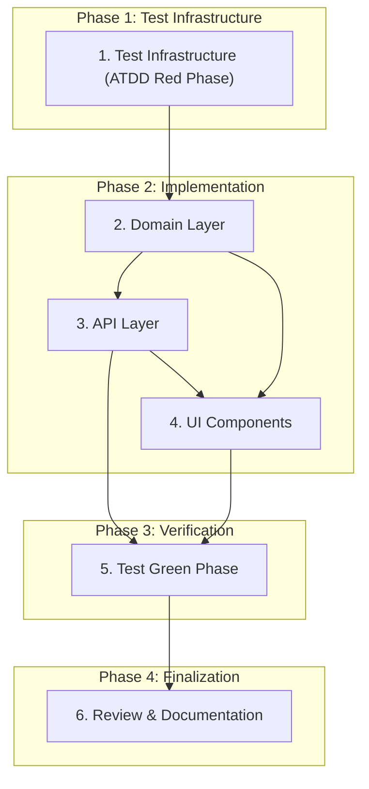

# Implementation Plan

## Overview

Implementasi Story 1.8 mengikuti pendekatan TDD dengan BMAD ATDD workflow. Story ini menambahkan halaman manajemen owner untuk COO, API endpoints CRUD, dan komponen picker yang dapat digunakan ulang untuk Epic 3. Semua perubahan data owner harus tercatat di audit trail dalam transaksi yang sama (AD-3). Perubahan status owner diblokir karena transisi hanya via event domain yang sah (AD-11).

## Tasks

- [x] 1. Test Infrastructure (ATDD Red Phase)
  - [x] 1.1 Generate ATDD checklist untuk Story 1.8
  - [x] 1.2 Buat red-phase API tests
  - [x] 1.3 Buat red-phase E2E tests

- [x] 2. Domain Layer
  - [x] 2.1 Tambah audit action constant
  - [x] 2.2 Buat Zod validation schemas
  - [x] 2.3 Implementasi owner service functions
  - [x] 2.4 Export dari identity module index

- [x] 3. API Layer
  - [x] 3.1 Implementasi GET /api/admin/owners
  - [x] 3.2 Implementasi GET /api/admin/owners/:id
  - [x] 3.3 Implementasi PUT /api/admin/owners/:id
  - [x] 3.4 Implementasi POST /api/admin/owners

- [x] 4. UI Components
  - [x] 4.1 Buat OwnerPicker component
  - [x] 4.2 Buat OwnerEditDialog component
  - [x] 4.3 Buat OwnerAddDialog component
  - [x] 4.4 Buat admin/owners page

- [x] 5. Test Green Phase
  - [x] 5.1 Jalankan API tests — All 14 tests passing
  - [x] 5.2 Jalankan E2E tests — All 5 tests passing (flaky issues fixed)
  - [x] 5.3 Jalankan full test suite

- [x] 6. Review & Documentation
  - [x] 6.1 Update sprint-status.yaml
  - [x] 6.2 Code review via bmad-code-review
  - [x] 6.3 Update status ke review

## Task Dependency Graph

```json
{
  "waves": [
    {
      "wave": 1,
      "tasks": ["1"],
      "description": "Test Infrastructure (ATDD Red Phase)"
    },
    {
      "wave": 2,
      "tasks": ["2"],
      "description": "Domain Layer"
    },
    {
      "wave": 3,
      "tasks": ["3", "4"],
      "description": "API Layer and UI Components (parallel after Domain)"
    },
    {
      "wave": 4,
      "tasks": ["5"],
      "description": "Test Green Phase"
    },
    {
      "wave": 5,
      "tasks": ["6"],
      "description": "Review & Documentation"
    }
  ],
  "dependencies": {
    "2": ["1"],
    "3": ["2"],
    "4": ["2"],
    "5": ["3", "4"],
    "6": ["5"]
  }
}
```



## Current Progress (2026-09-26)

### ✅ Story 1.8 Implementation Complete — Status: REVIEW

**Code Review Verdict: APPROVED**

Story 1.8 - Manajemen Owner oleh COO telah selesai diimplementasi dan siap untuk final review.

#### Implementation Summary

| Component | Status | Details |
|-----------|--------|---------|
| Domain Layer | ✅ Complete | `owner.service.ts`, validation schemas, audit constants |
| API Layer | ✅ Complete | 4 endpoints: GET list, GET detail, PUT update, POST create |
| UI Components | ✅ Complete | OwnerPicker, OwnerEditDialog, OwnerAddDialog, admin/owners page |
| Unit Tests | ✅ 104 passing | Service functions, validation, authorization |
| API Tests | ✅ 14 passing | All CRUD operations with auth checks |
| E2E Tests | ✅ 5 passing | Page access, dialogs, picker component |

#### Code Review Summary (2026-09-19)

- **Verdict**: APPROVED
- **Strengths**: 
  - Clean Architecture compliance (AD-3, AD-5, AD-8, AD-11)
  - Proper audit atomicity in all mutations
  - Status change protection working correctly
  - Responsive UI (drawer mobile, dialog desktop)
- **Non-blocking issues noted for future improvement**:
  - Consider extracting common dialog patterns
  - Add loading states for better UX
  - Review file at: `semantic-review/2026-09-19-152345-story-1-8.md`

#### Test Results

| Suite | Tests | Status |
|-------|-------|--------|
| Unit tests | 104 | All passing |
| API tests | 14 | All passing |
| E2E tests | 5 | All passing |

#### Files Modified/Created

**Domain Layer:**
- `server/domain/identity/owner.service.ts` — CRUD functions with audit
- `server/domain/identity/owner.schemas.ts` — Zod validation schemas
- `server/domain/identity/index.ts` — Module exports
- `shared/domain/audit.ts` — Added `kelola-owner-penambahan` action

**API Layer:**
- `server/api/admin/owners/index.get.ts` — List all owners
- `server/api/admin/owners/[id].get.ts` — Get owner detail
- `server/api/admin/owners/[id].put.ts` — Update owner (status blocked)
- `server/api/admin/owners/index.post.ts` — Create owner (terverifikasi)

**UI Components:**
- `app/components/admin/OwnerPicker.vue` — Reusable combobox
- `app/components/admin/OwnerEditDialog.vue` — Edit modal/sheet
- `app/components/admin/OwnerAddDialog.vue` — Create modal/sheet
- `app/pages/admin/owners.vue` — COO management page

**Tests:**
- `server/domain/identity/owner.service.test.ts` — Unit tests
- `tests/e2e/admin-owners.api.spec.ts` — API tests
- `tests/e2e/admin-owners.spec.ts` — E2E tests

#### Architecture Compliance

- **AD-3** (Audit Trail): ✅ All mutations write audit in same transaction
- **AD-5** (Module Ownership): ✅ Only identity module writes to owner tables
- **AD-8** (Server Authorization): ✅ COO check at route handler level
- **AD-11** (Status Protection): ✅ PUT rejects status field changes

#### Sprint Status

- `sprint-status.yaml`: `1-8-manajemen-owner-oleh-coo: review`
- Ready for final acceptance and merge to develop branch

## E2E Test Best Practices (Documented)

These patterns are now documented in .kiro/steering/project-context.md:

1. Always use waitForLoadState('networkidle') after page.goto()
2. Use test.describe.configure({ mode: 'serial' }) for tests sharing DB state
3. Wait for API responses before DOM assertions
4. Use expect.poll() for eventual consistency
5. Create isolated test data instead of editing shared rows

## Notes

- **ATDD Workflow**: Red-green-refactor cycle complete
- **Audit Trail (AD-3)**: All mutations properly audited
- **Status Protection (AD-11)**: Status changes blocked via API
- **COO Authorization**: All endpoints properly protected
- **Responsive UI**: Drawer (mobile) / Dialog (desktop) working
