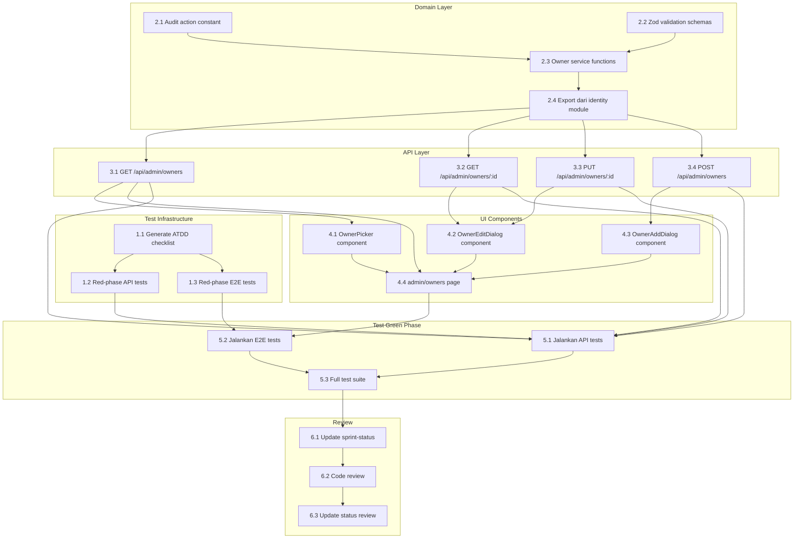

# Implementation Plan

## Overview

Implementasi Story 1.8 mengikuti pendekatan TDD dengan BMAD ATDD workflow. Story ini menambahkan halaman manajemen owner untuk COO, API endpoints CRUD, dan komponen picker yang dapat digunakan ulang untuk Epic 3. Semua perubahan data owner harus tercatat di audit trail dalam transaksi yang sama (AD-3). Perubahan status owner diblokir karena transisi hanya via event domain yang sah (AD-11).

## Tasks

- [x] 1. Test Infrastructure (ATDD Red Phase)
  - [x] 1.1 Generate ATDD checklist untuk Story 1.8
    - Jalankan `bmad-testarch-atdd` dengan input spec ini
    - Output: `_bmad-output/test-artifacts/atdd-checklist-1-8-manajemen-owner-coo.md`
    - _Requirements: 1, 2, 3, 4, 5_

  - [x] 1.2 Buat red-phase API tests
    - File: `tests/e2e/admin-owners.api.spec.ts`
    - Test cases: CRUD endpoints, authorization, status protection
    - _Requirements: 1, 2, 3, 5_

  - [x] 1.3 Buat red-phase E2E tests
    - File: `tests/e2e/admin-owners.spec.ts`
    - Test cases: Page access, edit flow, add flow
    - _Requirements: 1, 2, 3_

- [x] 2. Domain Layer
  - [x] 2.1 Tambah audit action constant
    - File: `shared/domain/audit.ts`
    - Tambah: `'kelola-owner-penambahan'` (kebab-case per konvensi existing)
    - Note: `'kelola-owner-perubahan'` sudah ada, reuse untuk edit
    - _Requirements: 2, 3_

  - [x] 2.2 Buat Zod validation schemas
    - File: `server/domain/identity/owner.schemas.ts`
    - Import `DAFTAR_HUBUNGAN` dari `#shared/domain/profil`
    - Schema untuk update dan create input
    - _Requirements: 2, 3, 5_

  - [x] 2.3 Implementasi owner service functions
    - File: `server/domain/identity/owner.service.ts`
    - Functions: `listOwners()`, `getOwnerById()`, `updateOwner()`, `createOwnerByCoo()`
    - _Requirements: 1, 2, 3, 4, 5_

  - [x] 2.4 Export dari identity module index
    - File: `server/domain/identity/index.ts`
    - Export function baru untuk penggunaan lintas modul
    - _Requirements: 1, 2, 3, 4, 5_

- [ ] 3. API Layer
  - [~] 3.1 Implementasi GET /api/admin/owners
    - File: `server/api/admin/owners/index.get.ts`
    - COO authorization check via `findActiveCooTenure`
    - _Requirements: 1, 4_

  - [~] 3.2 Implementasi GET /api/admin/owners/:id
    - File: `server/api/admin/owners/[id].get.ts`
    - COO authorization check via `findActiveCooTenure`, join related tables
    - _Requirements: 1, 2_

  - [~] 3.3 Implementasi PUT /api/admin/owners/:id
    - File: `server/api/admin/owners/[id].put.ts`
    - Validate input, reject status field (AD-11)
    - _Requirements: 2, 5_

  - [~] 3.4 Implementasi POST /api/admin/owners
    - File: `server/api/admin/owners/index.post.ts`
    - Check email uniqueness, set status `terverifikasi`
    - _Requirements: 3_

- [ ] 4. UI Components
  - [~] 4.1 Buat OwnerPicker component
    - File: `app/components/admin/OwnerPicker.vue`
    - Combobox dengan search, include semua owner
    - _Requirements: 4_

  - [~] 4.2 Buat OwnerEditDialog component
    - File: `app/components/admin/OwnerEditDialog.vue`
    - Sheet/Dialog dengan form fields
    - _Requirements: 2, 5_

  - [~] 4.3 Buat OwnerAddDialog component
    - File: `app/components/admin/OwnerAddDialog.vue`
    - Email required, note pre-approved status
    - _Requirements: 3_

  - [~] 4.4 Buat admin/owners page
    - File: `app/pages/admin/owners.vue`
    - COO-only middleware, table/card list
    - _Requirements: 1_

- [ ] 5. Test Green Phase
  - [~] 5.1 Jalankan API tests
    - Command: `npm run test:e2e -- tests/e2e/admin-owners.api.spec.ts`
    - _Requirements: 1, 2, 3, 4, 5_

  - [~] 5.2 Jalankan E2E tests
    - Command: `npm run test:e2e -- tests/e2e/admin-owners.spec.ts`
    - _Requirements: 1, 2, 3, 4, 5_

  - [~] 5.3 Jalankan full test suite
    - Command: `npm run test:e2e && npm run test`
    - _Requirements: 1, 2, 3, 4, 5_

- [ ] 6. Review & Documentation
  - [~] 6.1 Update sprint-status.yaml
    - File: `_bmad-output/implementation-artifacts/sprint-status.yaml`
    - Change status to `in-progress`

  - [~] 6.2 Code review via bmad-code-review
    - Jalankan skill untuk review kualitas

  - [~] 6.3 Update status ke review
    - Change sprint-status to `review`

## Task Dependency Graph

```json
{
  "waves": [
    {
      "wave": 1,
      "tasks": ["1.1", "2.1", "2.2"],
      "description": "Foundation: ATDD checklist generation dan domain primitives (audit constant, Zod schemas)"
    },
    {
      "wave": 2,
      "tasks": ["1.2", "1.3", "2.3"],
      "description": "Red phase tests dan owner service implementation"
    },
    {
      "wave": 3,
      "tasks": ["2.4"],
      "description": "Export identity module untuk API layer"
    },
    {
      "wave": 4,
      "tasks": ["3.1", "3.2", "3.3", "3.4"],
      "description": "API endpoints CRUD (dapat paralel setelah domain ready)"
    },
    {
      "wave": 5,
      "tasks": ["4.1", "4.2", "4.3"],
      "description": "UI components (picker dan dialogs)"
    },
    {
      "wave": 6,
      "tasks": ["4.4"],
      "description": "Admin owners page (depends on all components)"
    },
    {
      "wave": 7,
      "tasks": ["5.1", "5.2"],
      "description": "Green phase: API tests dan E2E tests"
    },
    {
      "wave": 8,
      "tasks": ["5.3"],
      "description": "Full test suite verification"
    },
    {
      "wave": 9,
      "tasks": ["6.1", "6.2", "6.3"],
      "description": "Review dan documentation (sequential)"
    }
  ]
}
```



## Notes

- **ATDD Workflow**: Implementasi mengikuti Test-Driven Development dengan red-green-refactor cycle. Task 1.x membuat failing tests (red), Task 2-4 implementasi (green), Task 5 verifikasi.
- **Audit Trail (AD-3)**: Semua operasi mutasi owner (create, update) harus mencatat audit dalam transaksi yang sama. Gunakan pattern existing di `server/domain/identity/owner.service.ts`.
- **Status Protection (AD-11)**: Field `status` owner tidak boleh diubah via API PUT — transisi status hanya melalui domain event yang sah (misalnya verifikasi email, suspend, dll).
- **COO Authorization**: Semua endpoint memerlukan validasi `findActiveCooTenure` — hanya COO aktif yang dapat mengakses halaman ini.
- **OwnerPicker Reusability**: Komponen ini dirancang untuk dipakai ulang di Epic 3 (manajemen kepemilikan saham).
- **Pre-approved Status**: Owner yang ditambahkan COO langsung berstatus `terverifikasi` tanpa perlu verifikasi email.