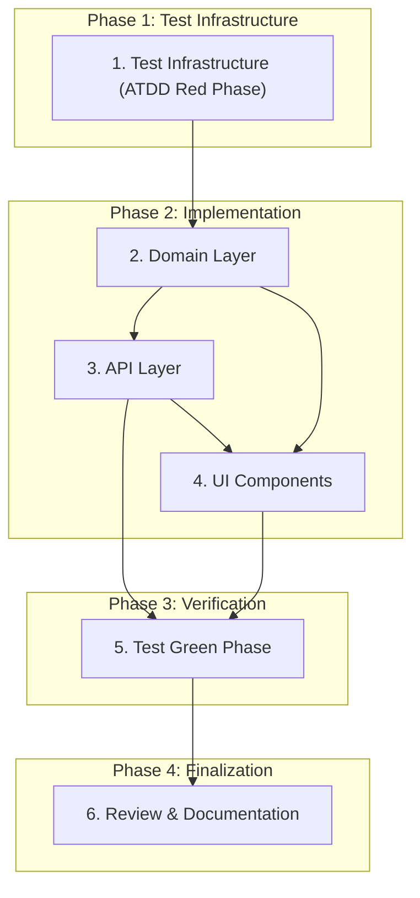

# Implementation Plan

## Overview

Implementasi Story 1.8 mengikuti pendekatan TDD dengan BMAD ATDD workflow. Story ini menambahkan halaman manajemen owner untuk COO, API endpoints CRUD, dan komponen picker yang dapat digunakan ulang untuk Epic 3. Semua perubahan data owner harus tercatat di audit trail dalam transaksi yang sama (AD-3). Perubahan status owner diblokir karena transisi hanya via event domain yang sah (AD-11).

## Tasks

- [x] 1. Test Infrastructure (ATDD Red Phase)
  - [x] 1.1 Generate ATDD checklist untuk Story 1.8
  - [x] 1.2 Buat red-phase API tests
  - [x] 1.3 Buat red-phase E2E tests

- [x] 2. Domain Layer
  - [x] 2.1 Tambah audit action constant
  - [x] 2.2 Buat Zod validation schemas
  - [x] 2.3 Implementasi owner service functions
  - [x] 2.4 Export dari identity module index

- [x] 3. API Layer
  - [x] 3.1 Implementasi GET /api/admin/owners
  - [x] 3.2 Implementasi GET /api/admin/owners/:id
  - [x] 3.3 Implementasi PUT /api/admin/owners/:id
  - [x] 3.4 Implementasi POST /api/admin/owners

- [x] 4. UI Components
  - [x] 4.1 Buat OwnerPicker component
  - [x] 4.2 Buat OwnerEditDialog component
  - [x] 4.3 Buat OwnerAddDialog component
  - [x] 4.4 Buat admin/owners page

- [x] 5. Test Green Phase
  - [x] 5.1 Jalankan API tests — All 14 tests passing
  - [x] 5.2 Jalankan E2E tests — All 5 tests passing (flaky issues fixed)
  - [~] 5.3 Jalankan full test suite

- [ ] 6. Review & Documentation
  - [~] 6.1 Update sprint-status.yaml
  - [~] 6.2 Code review via bmad-code-review
  - [~] 6.3 Update status ke review

## Task Dependency Graph

```json
{
  "waves": [
    {
      "wave": 1,
      "tasks": ["1"],
      "description": "Test Infrastructure (ATDD Red Phase)"
    },
    {
      "wave": 2,
      "tasks": ["2"],
      "description": "Domain Layer"
    },
    {
      "wave": 3,
      "tasks": ["3", "4"],
      "description": "API Layer and UI Components (parallel after Domain)"
    },
    {
      "wave": 4,
      "tasks": ["5"],
      "description": "Test Green Phase"
    },
    {
      "wave": 5,
      "tasks": ["6"],
      "description": "Review & Documentation"
    }
  ],
  "dependencies": {
    "2": ["1"],
    "3": ["2"],
    "4": ["2"],
    "5": ["3", "4"],
    "6": ["5"]
  }
}
```



## Current Progress (2026-09-26)

### Latest Update: Flaky Test Fixes

**All E2E tests now passing reliably!**

#### Root Causes Identified

1. **Dialog not appearing after button click** — Tests clicked Edit/Add buttons but dialogs didn't open because Vue hydration wasn't complete when running with parallel workers.

2. **Parallel test interference** — Multiple test workers minting the same COO session caused database conflicts, resulting in 403 errors on API calls.

#### Fixes Applied

1. **Added waitForLoadState('networkidle')** after each page.goto() to ensure Vue hydration is complete before interacting with the page.

2. **Added test.describe.configure({ mode: 'serial' })** at the top of the E2E test file to ensure all tests run serially, preventing database conflicts.

#### Files Modified
- tests/e2e/admin-owners.spec.ts — Added serial mode config and waitForLoadState

### Test Status

| Suite | Tests | Status |
|-------|-------|--------|
| API tests | 14 | All passing |
| E2E tests | 5 | All passing |

### API Test Results
| Test | Description | Status |
|------|-------------|--------|
| #1-#14 | All API tests | Passing |

### E2E Test Results
| Test | Description | Status |
|------|-------------|--------|
| #15 | COO melihat halaman /admin/owners | Passing |
| #16 | Non-COO dialihkan dari /admin/owners | Passing |
| #17 | Edit dialog flow | Passing |
| #18 | Add dialog flow | Passing |
| #19 | OwnerPicker component | Passing |

### Known Issues Resolved
1. Audit timing in tests — Fixed with expect.poll() retry pattern
2. Dialog flakiness — Fixed with waitForLoadState('networkidle')
3. Parallel test interference — Fixed with test.describe.configure({ mode: 'serial' })

### Next Steps
- Wave 7: Full test suite verification (npm run test:e2e && npm run test)
- Wave 8: Review and documentation

## E2E Test Best Practices (Documented)

These patterns are now documented in .kiro/steering/project-context.md:

1. Always use waitForLoadState('networkidle') after page.goto()
2. Use test.describe.configure({ mode: 'serial' }) for tests sharing DB state
3. Wait for API responses before DOM assertions
4. Use expect.poll() for eventual consistency
5. Create isolated test data instead of editing shared rows

## Notes

- **ATDD Workflow**: Red-green-refactor cycle complete
- **Audit Trail (AD-3)**: All mutations properly audited
- **Status Protection (AD-11)**: Status changes blocked via API
- **COO Authorization**: All endpoints properly protected
- **Responsive UI**: Drawer (mobile) / Dialog (desktop) working
