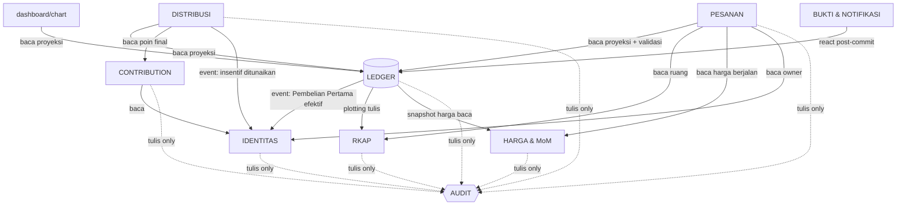
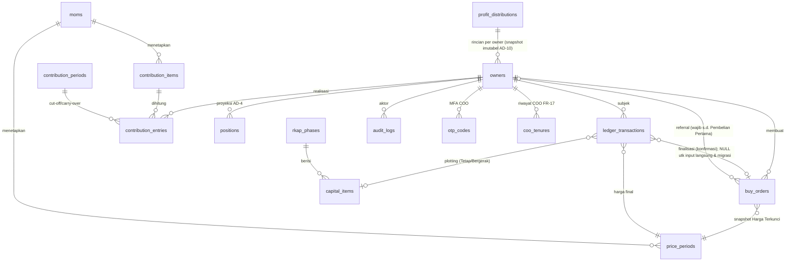
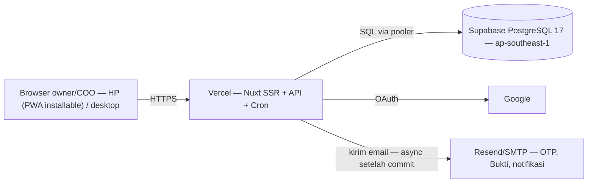

# Architecture Spine — Sip & Dip Ownership Dashboard (Phase 1)

## Design Paradigm

**Modular monolith server-rendered, ledger-centric.** Satu aplikasi Nuxt 4 (Vue + TypeScript) — satu repo, satu deployable di Vercel. Inti domain adalah **ledger**: tabel transaksi efektif append-only; seluruh tampilan (tabel kepemilikan, chart, Portion, Strength) adalah **proyeksi** turunannya. Interaktivitas berat (pratinjau pesanan FR-1, chart FR-18) hidup sebagai pulau klien Vue di atas halaman server-rendered. **PWA installable** adalah lapisan peningkatan bertahap di atas SSR — manifest + cache aset statis, seluruh data domain selalu daring (AD-12); di laptop tetap situs responsif biasa.

Pemetaan lapisan → direktori:

```text
app/ (halaman Vue SSR + pulau klien) → server/api (route handler tipis) → server/domain (modul domain) → Drizzle → PostgreSQL (Supabase)
shared/domain (rumus murni) — dipakai bersama server/domain dan pulau pratinjau
```

## Invariants & Rules

### AD-1 — Ledger adalah satu-satunya penulis posisi

- **Binds:** FR-4, FR-5, FR-18, SM-1
- **Prevents:** Dua jalur mutasi state kepemilikan yang bisa berbeda hitungan — penyebab utama selisih yang membunuh kepercayaan owner
- **Rule:** Tabel `ledger_transactions` append-only. Hanya modul LEDGER yang menulis tabel posisi kepemilikan, hanya melalui dua pintu finalisasi: konfirmasi COO (FR-20) dan input langsung COO (FR-21) — plus jalur import sekali jalan MIGRASI (FR-14) yang memakai API internal LEDGER. **Entry kompensasi (koreksi) adalah varian pintu input langsung**: wajib MFA (AD-8), pencatatan pembayaran koreksi, audit dengan referensi baris asal, dan **tanpa re-validasi gerbang domain** (kompensasi justru boleh memperbaiki state yang melanggar gerbang — mis. menurunkan Strength ≤ 100%) — di-enforce lewat API internal LEDGER yang sama; tidak ada jalur tulis posisi keempat. Modul lain membaca proyeksi, tidak pernah menulis posisi. Koreksi kesalahan tidak pernah UPDATE baris ledger — hanya **entry kompensasi** baru (bertanda referensi ke baris asal), tercatat di audit.

### AD-2 — Finalisasi transaksi atomik, satu penulis per baris status

- **Binds:** FR-20, FR-21, FR-23, FR-1, FR-19
- **Prevents:** Transaksi setengah jadi (pesanan efektif tanpa plotting RKAP, atau Fulfillment tercatat tanpa baris ledger); race dua owner memperebutkan ruang RKAP terakhir; dua jalur mengubah status pesanan yang sama bersamaan (konfirmasi vs kedaluwarsa cron vs penarikan owner)
- **Rule:** Konfirmasi dan input langsung berjalan dalam SATU transaksi DB berisi: append baris ledger + ubah status pesanan via compare-and-set `WHERE status = 'menunggu_konfirmasi' AND withdrawn_at IS NULL` (hanya pintu konfirmasi; input langsung tanpa pesanan) + pencatatan pembayaran (tanggal + metode — field di `ledger_transactions`, ditulis kedua pintu) + plotting alokasi ke Capital Item + penyesuaian instant Final Requirement (overshoot) + entry audit. **Penarikan owner (FR-19) adalah transisi tersimpan sendiri — bukan status:** kolom `buy_orders.withdrawn_at timestamptz` di-set dalam SATU transaksi bersama entry audit, via compare-and-set `WHERE status = 'menunggu_konfirmasi' AND withdrawn_at IS NULL`. **Definisi kanonik pesanan-pending: `status = 'menunggu_konfirmasi' AND withdrawn_at IS NULL`** — dipakai oleh pratinjau (AD-6), validasi submit, re-validasi konfirmasi, dan cron kedaluwarsa; SETIAP guard status pesanan wajib memuat `AND withdrawn_at IS NULL`. Urutan lock adalah **urutan global seluruh keluarga transaksi penulis**: `buy_orders → rkap_phases → positions → owners → contribution_periods → distribution` — SELURUH penulis RKAP (konfirmasi, input langsung, penyesuaian manual COO, penambahan Capital Item, rebalancing) dan seluruh penulis status owner/rekap (AD-11) mengambil lock mengikuti urutan ini dan me-re-validasi batas agregat penyesuaian di dalam transaksi — first-confirm wins, yang kalah masuk re-validasi gagal (Ditolak + penjelasan hitungan). Kedaluwarsa cron (FR-19) juga compare-and-set dengan guard kanonik — hanya satu penulis yang berhasil per baris. **Fulfillment dihitung dari alokasi plotting di ledger (derived) — bukan kolom tulisan terpisah.**

### AD-3 — Audit trail atomik dan append-only

- **Binds:** FR-12
- **Prevents:** Catatan audit yang bisa hilang/tertunda saat aksi terjadi, atau diubah/dihapus setelahnya
- **Rule:** Entry audit ditulis dalam transaksi DB yang sama dengan aksinya — tidak pernah async. Tabel `audit_logs` tanpa jalur UPDATE/DELETE (enforced lewat DB grants); aktor berbentuk `user` (owner/COO) atau `system` (cron); nama event dari registry enum terpusat, envelope `{ actor, action, target, details jsonb }`. Pembacaan hanya untuk tampilan COO; modul lain tidak membaca audit untuk keputusan bisnis.

### AD-4 — Posisi materialized terkopling atomik dengan ledger

- **Binds:** FR-4, FR-5, FR-18, SM-1
- **Prevents:** Tabel posisi yang drift dari ledger (dua sumber kebenaran yang tidak selaras)
- **Rule:** Posisi per owner (Quantity, Shares, Ceil, Actual per jenis modal) disimpan sebagai **tabel biasa yang dipelihara sebagai proyeksi** (bukan PG MATERIALIZED VIEW — harus bisa diupdate dalam transaksi append ledger, AD-2). Update posisi HANYA boleh terjadi di dalam transaksi append ledger. Rekomputasi penuh dari ledger disediakan sebagai alat rekonsiliasi berkala — hasil rekomputasi adalah pembanding audit, bukan jalur tulis.

### AD-5 — Kepemilikan tabel mutlak per modul

- **Binds:** semua modul
- **Prevents:** Modul menimpa data milik modul lain (mis. PESANAN mengubah harga, RKAP mengubah Profile)
- **Rule:** Setiap tabel dimiliki tepat satu modul domain (IDENTITAS: owner/profile/role/coo_tenures/`otp_codes`; LEDGER: transaksi/posisi; RKAP: fase/capital item; HARGA: harga/MoM; CONTRIBUTION: item/realisasi/periode; DISTRIBUSI: rekap; AUDIT: audit_logs; PESANAN: buy_orders; PROOFS: outbox email). Permintaan OTP MFA (FR-3) adalah API publik IDENTITAS — `requestOtp`; **verifikasi dan konsumsi terjadi di dalam transaksi finalisasi (AD-2/AD-8)** via API IDENTITAS yang menerima `tx`, single-use via compare-and-set pada barisnya. Akses lintas modul lewat API/ekspor modul, bukan menulis tabel tetangga. Tabel outbox ditulis **di dalam transaksi aksi terkait** (menjamin tidak ada email hilang saat crash); pengiriman async dengan retry oleh PROOFS. Arah dependensi:



### AD-6 — Satu implementasi rumus domain

- **Binds:** FR-1, FR-20, FR-21, FR-16, SM-1
- **Prevents:** Pratinjau klien dan validasi server berbeda hasil hitungan (rumus duplikat di dua tempat); dua tim merangkai input validasi Strength dengan cara berbeda
- **Rule:** Seluruh rumus domain murni hidup di `shared/domain` sebagai modul TS murni tanpa I/O — pembobotan (Ceil, Shares, Strength, **Portion dan seluruh persentase turunan chart**, RTL, Quantity maksimal, batas penyesuaian RKAP, pembulatan half-up 2 desimal), distribusi laba (Dividen = Portion × pool, Insentif = poin ÷ total poin × pool, pembentukan budget pool per ratio RUPS), dan **fungsi perakitan input kanonik per gerbang validasi**: Strength (posisi terkini + seluruh pesanan-pending kanonik AD-2), ruang RKAP (= Σ Final Requirement − Fulfillment dari transaksi **efektif saja** — pesanan antrai tidak pernah mereservasi ruang, milik owner mana pun), sisa batas penyesuaian (Σ penyesuaian fase), dan "harga 1 saham berjalan" (= harga berjalan pada **momen evaluasi gerbang**: submit untuk pratinjau & validasi submit, finalisasi untuk re-validasi, saat aksinya untuk penyesuaian manual RKAP). Pratinjau (FR-1), validasi submit, dan re-validasi konfirmasi memanggil **fungsi assembly yang sama** — diimpor oleh server route (validasi otoritatif) dan pulau pratinjau. Island chart menerima angka display siap-format dari payload atau mengimpor fungsi shared — tidak ada aritmetika rasio lokal di komponen. Server tetap satu-satunya otoritas keputusan.

### AD-7 — Harga Terkunci, re-validasi berlapis

- **Binds:** FR-1, FR-20, FR-21, FR-6, FR-22
- **Prevents:** Transaksi memakai harga yang berbeda dari yang disepakati saat submit; finalisasi memakai kondisi usang; referral sah ditolak mesin (atau referral palsu lolos)
- **Rule:** Pesanan menyimpan snapshot harga berlaku pada tanggal submit (Harga Terkunci). Tepat **SATU baris `price_periods` per (jenis harga, tanggal efektif)** — unique constraint; koreksi harga pada tanggal efektif yang sama = mengubah baris berjalan + audit, bukan menambah baris kedua; resolusi "harga berjalan pada tanggal X" selalu tepat satu baris. **Harga Terkunci disimpan sebagai nilai pada `buy_orders` dan harga final sebagai nilai pada `ledger_transactions`** (FK hanya menunjuk baris asal) — mengubah baris harga (koreksi) tidak pernah mengubah nilai yang telah ter-snapshot atau ter-final; Bukti dan re-validasi selalu memakai nilai tersimpan, bukan isi mutakhir baris harga. Finalisasi memakai harga terkunci namun me-re-validasi kondisi terkini sebelum commit (AD-2). Re-validasi referral pada Pembelian Pertama terbagi dua: **cek mekanis** di mesin (referral ada dalam pilihan sah — fungsi kanonik `pilihanReferral` AD-8: pemegang saham atau owner belum pernah beli) dan **penilaian manusia** COO untuk cross-referral hari yang sama (keputusan tercatat di audit) — mesin tidak menolak otomatis kasus itu.

### AD-8 — Akses tiga tingkat dipaksa di batas server

- **Binds:** FR-15, FR-22, FR-3, FR-13, FR-17, §4.8
- **Prevents:** Logika akses yang hanya hidup di UI (bisa dilewati dengan panggilan API langsung); keterbukaan yang bocor ke owner tanpa saham
- **Rule:** Autentikasi via NuxtAuth (Google OAuth, dicocokkan email saat migrasi). Role (Calon Owner terverifikasi / Owner pemegang saham / COO) dan matriks keterbukaan §4.8 (termasuk pembukaan otomatis pasca Pembelian Pertama efektif, pergantian COO FR-17) dienforce di middleware server + tiap route handler — tidak pernah di klien saja. Predikat akses/keterbukaan (`aksesPenuh`), kewajiban referral (`perluReferral`), dan himpunan `pilihanReferral` adalah **fungsi kanonik tunggal di IDENTITAS atas status siklus hidup (AD-11)** — tidak pernah diturunkan dari `positions.shares` live. Kewenangan COO diautoritaskan **di dalam transaksi finalisasi** (cek `coo_tenures` berlaku pada `now()`) — bukan hanya sesi/middleware; aktor audit = pejabat pada saat commit. **Himpunan tertutup aksi ber-MFA Phase 1: konfirmasi (FR-20), input langsung (FR-21), dan entry kompensasi ledger (varian input langsung — AD-1)** — dan eksplisit BUKAN: penyesuaian RKAP, penetapan harga, cut-off, rebalancing, pergantian COO; endpoint dan UI wajib mengacu himpunan yang sama, mengubah himpunan = mengubah AD ini. OTP email terikat tepat satu instance aksi: baris `otp_codes` menyimpan `{action_type, target_ref}`; **verifikasi dan konsumsi terjadi di DALAM transaksi finalisasi** via API IDENTITAS yang menerima `tx`; rollback re-validasi mengembalikan konsumsi (retry tanpa email baru). **Penghitung percobaan gagal ditulis dalam transaksi terpisah yang selalu commit** (di luar tx finalisasi) oleh IDENTITAS saat verifikasi gagal; batas percobaan dicek sebelum verifikasi; `requestOtp` baru **meng-invalideasi semua kode hidup sebelumnya** untuk `(action_type, target_ref)` tersebut — maksimum satu baris OTP hidup per aksi; resend-cooldown (60 detik) dienforce server-side.

### AD-9 — Operasional: Vercel + Supabase, cron harian, backup

- **Binds:** FR-19, FR-22, envelope deployment & operations
- **Prevents:** Job tersembunyi yang tidak jalan; dua lingkungan produksi yang berbeda perilaku; kehilangan ledger tanpa pemulihan
- **Rule:** Produksi = Vercel (SSR + API routes, **Node 24 LTS; engines floor `>=22.19.0`**) + Supabase PostgreSQL 17 region ap-southeast-1 (Singapore) via connection pooler. Vercel Cron (UTC) memanggil endpoint terproteksi (CRON_SECRET) tiap hari: kedaluwarsa pesanan hari-7 (FR-19) + pengingat/kedaluwarsa pendaftar (FR-22) — **batas hari dihitung di dalam endpoint memakai zona Asia/Jakarta**, bukan jam trigger UTC. Backup: Supabase backup harian/PITR aktif + satu drill restore terdokumentasi sebelum go-live (ledger adalah aset taktergantikan). Pengembangan lokal via Supabase CLI (Docker). Lingkungan: `local` + `production` saja.

### AD-10 — Uang dan metrik: numeric integer-safe

- **Binds:** NFR §4.8, FR-16, FR-23
- **Prevents:** Error pembulatan float menular ke hitungan kepemilikan/distribusi
- **Rule:** Seluruh nilai rupiah di DB bertipe `numeric(18,2)`; Quantity, Shares, Ceil, bobot, plafon bertipe integer; ratio/persentase `numeric(9,6)` dihitung presisi penuh dan dibulatkan half-up 2 desimal hanya saat penyajian. JavaScript tidak pernah menghitung uang dengan `number` — operasi aritmetika uang hanya di `shared/domain` memakai **decimal library (satu mekanisme, dipin dan dicatat saat scaffold; campuran idiom integer-sen dilarang)**. **Kontrak kawat:** seluruh nilai uang & ratio melewati batas API/SSR sebagai string desimal berskala tetap; `shared/domain` memuat SATU pasangan parse/serialize yang diizinkan; `Number()`/`parseFloat()` atas nilai uang/ratio dilarang di semua lapisan, termasuk display. Distribusi laba: Portion dan poin dipakai presisi penuh saat menghitung; rekap RUPS menyimpan **snapshot imutabel** dari angka yang dipakai (pembanding antar-RUPS FR-16); rekap menjumlahkan poin dari **SEMUA periode ter-finalisasi-belum-tertunaikan** — "ditandai selesai" (cut-off FR-10) ≠ "ditunaikan" (rekap FR-16), penandaan tertunaikan atomik dengan penyimpanan rekap. **Cut-off membekukan snapshot poin sah per owner per periode (imutabel) — rekap hanya membaca snapshot terbeku, tidak pernah re-derive dari entries; `contribution_entries` pada periode ter-finalisasi beku: koreksi/backdating pasca cut-off hanya masuk periode berikut sebagai penyesuaian carry-over, writer entries wajib menolak menulis ke periode berstatus final.** Sisa pembulatan per-owner terhadap pool tercatat sebagai baris penyesuaian di rekap.

### AD-11 — Siklus hidup owner punya satu penulis

- **Binds:** FR-13, FR-22, FR-16, FR-17, Glossary Owner/Keluar/Pembelian Pertama
- **Prevents:** Dua modul mengubah status owner dengan aturan berbeda; definisi "Pembelian Pertama efektif" yang dihitung beda oleh tim identitas vs tim transaksi
- **Rule:** Hanya IDENTITAS yang menulis status owner. **Enum siklus hidup owner/pendaftaran (dipinkan): `diajukan` / `terverifikasi` / `ditolak` / `kedaluwarsa` / `keluar`** (+ `first_effective_at timestamptz`, di-set HANYA oleh event Pembelian Pertama efektif). Setiap transisi status adalah **compare-and-set atas status sebelumnya** dalam satu transaksi DB — termasuk pendaftaran (FR-22): verifikasi COO (me-re-validasi kelengkapan Profile di dalam tx verifikasi) vs kedaluwarsa cron (7 hari per UX) vs kelengkapan Profile adalah race tiga penulis yang dijaga CAS yang sama dengan AD-2; kedaluwarsa pendaftaran = status tersimpan yang di-set cron; **owners unik per email (unique constraint); re-daftar = CAS `kedaluwarsa → diajukan` pada baris yang sama** (edge transisi legal, tercatat audit) — tidak pernah baris owner baru untuk email yang sama; event expiry masuk audit. Transisi adalah reaksi atas event domain: `Pembelian Pertama efektif` (= transaksi ledger PERTAMA seorang owner yang mencapai efektif; pesanan ditolak/ditarik/kedaluwarsa tidak pernah menghasilkan baris ledger) → membuka transparansi penuh; `Insentif owner tanpa saham ditunaikan di rekap RUPS` (event dari DISTRIBUSI) → status Keluar — **kandidat flip = seluruh owner dengan `positions.shares = 0` pada transaksi rekap** (dengan atau tanpa insentif ditunaikan: kepemilikan berakhir saat saham nol); transaksi efektif baru → reaktivasi. Definisi, transisi, dan predikat turunannya (`aksesPenuh`, `perluReferral`, `pilihanReferral` — AD-8) hidup di IDENTITAS sebagai satu fungsi, dipanggil dari alur finalisasi (AD-2) dan rekap; owner `keluar` yang belum pernah membeli termasuk cakupan `perluReferral` dan `pilihanReferral`. Flip → `Keluar` oleh rekap wajib me-re-validasi `positions.shares = 0` di dalam transaksi rekap **mengikuti urutan lock global AD-2** — set eligibility pra-hitung bersifat indikatif, re-validasi in-tx yang otoritatif; rekap membaca posisi pada snapshot konsisten (ΣPortion internal konsisten sebelum dibekukan, AD-10).

### AD-12 — Satu basis kode dua postur; PWA installable, data selalu daring

- **Binds:** §6.1, UJ-1, UJ-2, UJ-6, Non-Goals §5, EXPERIENCE.md (Foundation & Postur)
- **Prevents:** Cabang basis kode per perangkat (varian mobile vs desktop yang drift); service worker — atau lapisan cache HTTP/edge — menyajikan angka domain (posisi, chart, pesanan) yang usang setelah transaksi baru; antrean tulis luring yang menjadi jalur mutasi kedua di luar pintu finalisasi AD-2; pembaruan service worker yang me-reload di tengah dialog transaksional; konteks terpasang yang menjadi postur ketiga tak beraturan
- **Rule:** Satu basis kode web responsif dengan dua postur — mobile `<lg` (dominan owner) dan desktop `≥lg` (alur berat COO) — tanpa kapabilitas yang hanya hidup di satu postur. **Konteks terpasang (installed) adalah viewport, bukan postur ketiga**: manifest memakai `display: standalone` **tanpa** `orientation`; postur tetap diturunkan semata dari lebar viewport terhadap `lg`; tidak ada perilaku yang meng-key off `display-mode` selain affordance prompt instalasi.

  PWA diaktifkan lewat `@vite-pwa/nuxt` (`generateSW`, atau SW kustom yang direviu terhadap AD ini) dengan batas cache yang didefinisikan tegas: **cangkang aplikasi = aset build ter-fingerprint (JS/CSS/gambar) + web app manifest + ikon + tepat satu halaman statis `/offline` — tidak lebih.** Dokumen navigasi (HTML hasil SSR) dan payload Nuxt adalah **data domain**: tidak boleh di-precache, tidak boleh di-cache runtime, `navigateFallback` hanya ke `/offline`.

  "Selalu daring" mengikat seluruh lapisan cache, bukan hanya service worker: dokumen SSR dan respons `/api/**` dibawakan `Cache-Control: no-store`; route rules `swr`/`isr`/handler cache server dilarang untuk rute domain; cache `immutable` hanya untuk aset ter-fingerprint. Service worker tidak pernah mensintesis respons API — kegagalan fetch diteruskan apa adanya dan dirender oleh state pattern permukaan terkait; shell `/offline` hanya untuk permintaan dokumen yang gagal, isinya persis status global "Tidak dapat terhubung" + Coba lagi (EXPERIENCE.md; Coba lagi = navigasi ulang penuh).

  Pembaruan service worker: `registerType: 'prompt'` tanpa `skipWaiting` otomatis — versi baru aktif saat muat natural berikutnya; prompt pembaruan tidak boleh muncul di atas dialog transaksional (MFA, konfirmasi, input langsung, cut-off, penyesuaian RKAP); reload hanya atas aksi eksplisit pengguna di luar dialog yang terbuka.

  **Kontrak kesegaran runtime (view, bukan cache):** permukaan bernilai domain wajib salah satu — (a) refetch penuh pada `visibilitychange`/focus, atau (b) penanda waktu data ("per …") yang diperbarui bersama payload. Tabel dan island pada halaman yang sama mengonsumsi **SATU payload bersama** (SSR-embedded atau satu fetch) — tidak ada fetch domain independen per island pada render awal.

## Consistency Conventions

| Concern | Convention |
| --- | --- |
| Penamaan | Istilah Glossary PRD verbatim di UI dan identifier (Quantity, Shares, Ceil, Strength, Portion, Contribution, RTL, Actual, Fulfillment, Shortfall, Utilization, Achievement, Held); nilai Capital Type selalu `Modal Tetap` / `Modal Bergerak` / `Modal Operasional`; tabel DB snake_case jamak (`buy_orders`, `ledger_transactions`, `audit_logs`); komponen Vue PascalCase; file TS kebab-case |
| Data & format | ID `uuid`; tanggal disimpan `timestamptz` UTC; **seluruh aturan kalender-hari (expiry hari-7 FR-19, tanggal efektif harga FR-6, "hari yang sama" referral FR-22, cut-off FR-10) dihitung dalam zona Asia/Jakarta**; uang `numeric(18,2)` (AD-10); bentuk error API seragam `{ code, message, details }`; status pesanan enum: `menunggu_konfirmasi` / `terkonfirmasi` / `ditolak` / `kedaluwarsa` (penarikan = kolom `withdrawn_at` + event audit, bukan status; **pesanan-pending kanonik** = `status = 'menunggu_konfirmasi' AND withdrawn_at IS NULL` — AD-2; **penolakan saat submit = tanpa baris pesanan**, hanya audit); status owner/pendaftaran enum: `diajukan` / `terverifikasi` / `ditolak` / `kedaluwarsa` / `keluar` (AD-11); `price_periods` unique per (jenis harga, tanggal efektif) — koreksi = ubah baris + audit (AD-7); ambang kelompok kap Big/Medium/Small Cap = data konfigurasi, bukan konstanta kode |
| State & cross-cutting | Setiap tulis multi-tabel wajib satu transaksi DB; email keluar via outbox (baris ditulis dalam transaksi aksi, pengiriman async + retry oleh PROOFS); **Bukti Transaksi = fungsi murni state ledger pada titik potong transaksinya** — regenerasi (retry outbox maupun unduh ulang) selalu menghitung pada titik potong yang sama, tidak pernah dari posisi mutakhir — dirender via `@react-pdf/renderer`, format mengikuti Template Konfirmasi Pembelian Saham v3; konfigurasi via env; log terstruktur |
| Platform | Satu basis kode dua postur, breakpoint tunggal `lg` (1024px) — semua alur fungsional di keduanya; **substrate komponen UI = shadcn-vue (primitif reka-ui) + Tailwind — implementasi Vue dari kontrak shadcn DESIGN.md, smoke-test paritas saat scaffold**; PWA installable via `@vite-pwa/nuxt` (AD-12): cache hanya aset ter-fingerprint + `/offline`, dokumen SSR & API `no-store`, tanpa `swr`/`isr` rute domain, tanpa antrean tulis luring; konteks installed = viewport, bukan postur; kesegaran runtime per AD-12 |
| Migrasi | Import memakai pintu finalisasi LEDGER **lengkap sesuai isi AD-2 — termasuk plotting alokasi per Capital Item** (direkonstruksi dari kolom Pemenuhan spreadsheet; acceptance mencakup paritas Fulfillment Rate per jenis modal, bukan hanya Grand Total) **dan pencatatan pembayaran historis** (metode `'migrasi'` bila tak diketahui) — NAMUN **tanpa re-validasi gerbang domain** (Strength, ruang RKAP, batas penyesuaian) dan **tanpa penyesuaian instant** atas baris historis: data spreadsheet otoritatif, gerbang berlaku untuk transaksi baru pasca go-live saja. **Tanpa baris outbox email untuk transaksi berlabel migrasi** — Bukti migrasi hanya regenerate-on-demand; daftar event diteruskan vs disupres dideklarasikan eksplisit di modul MIGRASI dan diuji pada acceptance migrasi. HARGA: `price_periods` historis berlabel "migrasi" — FK harga tidak pernah null. Aktor migrasi tercatat `system` |
| Testing | `shared/domain` wajib unit test (contoh verifikasi PRD: 2 saham Modal Bergerak → Shares 4/Ceil 6/Strength 66,67%; ceil RKAP 861 saham; ratio 5/41/54; distribusi laba 12jt/2jt → total hak owner contoh 4.340.000) + acceptance migrasi: Grand Total = Quantity 3.622, Shares 5.187, Ceil 14.980 — gerbang SM-1 |
| Bahasa | UI Bahasa Indonesia; istilah metrik tetap English per Glossary §3 |

## Quick Reference — Do / Don't

Bukan keputusan baru — penyaringan AD di atas jadi bentuk yang bisa dicek reviewer story. Setiap baris menunjuk aturan sumbernya.

| Do | Don't | Sumber |
| --- | --- | --- |
| Seluruh hitungan metrik/uang lewat `shared/domain` | Menghitung Strength/Portion/dividen di komponen Vue, route handler, atau query SQL tercecer | AD-6, AD-10 |
| Tulis multi-tabel dalam satu transaksi DB | Menulis posisi/audit/plotting di luar transaksi finalisasi | AD-1, AD-2, AD-4 |
| Import lintas modul lewat `index.ts` publik | Import file dalam folder modul lain; menulis tabel milik modul tetangga | AD-5, Structural Seed |
| `pages/` tipis — parsing + panggil API + render | Logika domain di page/komponen; SQL di komponen | Paradigma, AD-5 |
| Ubah status pesanan dengan compare-and-set | Read-then-write status (race konfirmasi vs cron vs penarikan) | AD-2 |
| Simpan snapshot harga saat submit; finalisasi pakai harga terkunci | Membaca harga berjalan ulang saat finalisasi | AD-7 |
| Kirim email via outbox (baris in-tx, kirim async + retry) | Kirim email inline dalam handler tanpa outbox | AD-5, konvensi State |
| Cek role + keterbukaan di route handler/middleware server | Berhenti di `v-if` role di komponen | AD-8 |
| Aturan kalender-hari (hari-7, "hari yang sama") via helper `shared/domain` zona Asia/Jakarta | Membandingkan `new Date()` mentah (UTC vs lokal) | AD-9, konvensi Data & format |
| Penolakan saat submit = tanpa baris pesanan (audit saja) | Membuat baris pesanan berstatus `ditolak` untuk penolakan pre-antrian | Konvensi Data & format, FR-1/FR-19 |
| Uang `numeric(18,2)` di DB; aritmetika via `shared/domain` | `number`/float JavaScript untuk nilai rupiah; `parseFloat` uang | AD-10 |
| Rancang tiap alur untuk dua postur (`<lg`/`≥lg`) | Kapabilitas yang hanya hidup di satu postur | AD-12 |
| Cache hanya aset ter-fingerprint + `/offline`; dokumen SSR & `/api/**` `no-store` | Precache/navigateFallback HTML rute; runtime-cache dokumen atau `/api/**`; route rules `swr`/`isr` rute domain; antrean tulis luring | AD-12 |
| Fungsi lintas modul di jalur finalisasi menerima `tx`; transaksi dibuka hanya di service teratas | Service yang membuka transaksinya sendiri saat dikomposisi (atomicity AD-2 hilang diam-diam) | AD-5, AD-2 |
| Transisi status owner via compare-and-set; rekap re-validasi `shares = 0` in-tx | Flip status by id dari set pra-hitung — pemegang saham bisa terbalik jadi `Keluar` | AD-11, AD-2 |
| Guard status pesanan selalu menyertakan `AND withdrawn_at IS NULL`; pending kanonik satu definisi | Menghitung pesanan ditarik sebagai pending di pratinjau/cron/re-validasi | AD-2 |
| Ambil lock mengikuti urutan global (`buy_orders → rkap_phases → positions → owners → contribution_periods → distribution`) | Lock owner dulu lalu position (deadlock AB-BA finalisasi vs rekap) | AD-2, AD-11 |
| OTP diverifikasi & dikonsumsi dalam tx finalisasi, terikat `{action_type, target_ref}` | Token MFA lintas aksi/lintas target; verify di luar tx | AD-8, AD-5 |
| Kirim uang/ratio lintas API/SSR sebagai string desimal; parse/serialize hanya via pasangan tunggal `shared/domain` | `Number()`/`parseFloat()` nilai uang/ratio di lapisan mana pun, termasuk display | AD-10 |
| Bukti dihitung pada titik potong transaksinya | Regenerasi Bukti dari posisi mutakhir | Konvensi State |
| Refetch on visibility atau penanda "per …"; tabel + island satu payload bersama | Fetch domain independen per island; tab lama menyajikan angka tanpa sinyal usang | AD-12 |

## Stack

SEED — diverifikasi web Sep 2026 (kecuali bertanda); kode memiliki versi ini begitu ada.

| Name | Version |
| --- | --- |
| Nuxt (Vue 3 + TypeScript) | 4.x (4.5.2 terverifikasi) — **Node 24 LTS (24.21.x) untuk dev/CI/Vercel; engines floor `>=22.19.0`** (Node 22 security-only) |
| shadcn-vue (primitif reka-ui) + Tailwind — substrate komponen UI | implementasi Vue dari kontrak shadcn DESIGN.md — pin versi saat scaffold (catat major Tailwind saat itu juga; jendela aktif Node 24 berakhir Okt 2026 — recek saat scaffold); **wajib smoke-test paritas komponen kontrak (Dialog/Sheet/Tooltip/Drawer/Input-OTP/Toast) di Nuxt 4 saat scaffold** |
| Nitro (server engine bawaan Nuxt) | bawaan Nuxt 4 |
| Drizzle ORM | **pin eksak `drizzle-orm@0.45.2`** (v1.0 di rc.4 per Sep 2026 — bukan GA; cek dist-tag saat scaffold: bila 1.0.0 GA, ambil + ulangi smoke migrasi) |
| drizzle-kit | **pin eksak `drizzle-kit@0.31.10`** |
| postgres.js (driver PG) | pin **3.4.9** saat scaffold |
| PostgreSQL (Supabase, region Singapore) | 17 — konfirmasi major saat pembuatan project |
| NuxtAuth (sidebase, Auth.js provider Google) | 1.3.1 — **wajib smoke-test OAuth Google + session di Nuxt 4 saat scaffold** (modul Nuxt 3, menunggangi next-auth v4); **fallback bila gagal: `nuxt-auth-utils` atau OAuth manual via route handler (tetap memenuhi AD-8)** |
| @vite-pwa/nuxt (PWA installable — AD-12) | 1.1.1 — **kompatibilitas Nuxt 4 TIDAK dinyatakan vendor** (modul Nuxt 3: `@nuxt/kit ^3.9.0`, rilis terakhir Feb 2026; Nuxt 4.5 kini Vite 8/Rolldown); **gerbang go/no-go = smoke-test BUILD (generateSW) + install + prompt pembaruan di Nuxt 4.5 saat scaffold; fallback: `vite-plugin-pwa` langsung / SW kustom direviu terhadap AD-12** |
| @react-pdf/renderer (Bukti Transaksi) | latest stable (4.9.0; React = peer dep server-only, font di-bundle; sumber: github.com/diegomura/react-pdf) |
| Resend / SMTP (email keluar) | layanan — pin saat scaffold (+ SPF/DKIM & From-domain, lihat Deferred) |
| Vercel + Vercel Cron | layanan (cron UTC — lihat AD-9) |
| Library chart (FR-18) | *Deferred* — lihat bawah |

## Structural Seed

```text
snd-dash/
  app/                      # UI Vue (SSR + pulau klien)
    pages/                  #   route halaman (dashboard, pesanan, admin COO) — TIPIS: parsing + panggil API
    components/             #   komponen; pulau interaktif (pratinjau pesanan, chart) di components/islands/
    composables/            #   logika klien bersama (fetch, state sesi)
  server/
    api/                    # route handler tipis — parsing, auth, delegasi ke domain
    domain/                 # modul domain — SEMUA memakai bentuk internal seragam (lihat bawah)
      identity/ orders/ ledger/ rkap/ pricing/ contribution/ distribution/ proofs/ audit/ migration/
    jobs/                   # endpoint cron terproteksi (expiry, pengingat)
  shared/
    domain/                 # rumus murni AD-6 + helper kalender-hari — tanpa I/O, tanpa framework
  drizzle/                  # skema + migrasi
```

Bentuk internal setiap modul domain (konvensi seed — kode memiliki detailnya begitu ada):

```text
server/domain/<modul>/
  index.ts        # SATU-SATUNYA pintu impor lintas modul (enforce AD-5)
  *.service.ts    # kasus penggunaan / orkestrasi transaksi
  *.repo.ts       # satu-satunya tempat query Drizzle untuk tabel milik modul
  events.ts       # deklarasi event domain yang dipancarkan (bila modul memancarkan)
```

Import dalam folder modul lain (`server/domain/rkap/internal/...`) dilarang — lintas modul hanya lewat `index.ts`-nya.

Fungsi modul yang berpartisipasi dalam transaksi lintas modul menerima handle transaksi (`tx`) sebagai parameter dan bergabung padanya — hanya service level teratas yang membuka transaksi baru, sehingga transaksi AD-2 dapat mengomposisi RKAP/AUDIT/PROOFS/IDENTITAS dalam satu tx.

Entitas inti (nama + relasi; atribut yang merupakan invariant hidup di AD):



Topologi deployment & envelope operasional:



## Capability → Architecture Map

| Capability / Area | Lives in | Governed by |
| --- | --- | --- |
| FR-1, FR-19, FR-20, FR-21, FR-3 (pesanan, antrian, konfirmasi, input langsung, MFA) | `server/domain/orders` + `server/domain/ledger` + pulau pratinjau `app/components` | AD-2, AD-6, AD-7, AD-8 |
| FR-4, FR-5, FR-18 (tabel & chart kepemilikan) | `app/pages` dashboard + proyeksi LEDGER | AD-1, AD-4 |
| FR-6, FR-7 (harga CMS, MoM) | `server/domain/pricing` | AD-7, konvensi |
| FR-8, FR-9, FR-10 (Contribution, cut-off) | `server/domain/contribution` | AD-5 |
| FR-16 (distribusi laba) | `server/domain/distribution` | AD-5 (read-only), AD-6, AD-10, AD-11 |
| FR-23 (RKAP, gerbang, penyesuaian instant) | `server/domain/rkap` | AD-2, AD-6, AD-7 |
| FR-11 (Bukti Transaksi) | `server/domain/proofs` | AD-5 (react post-commit, outbox), konvensi |
| FR-12 (audit trail) | `server/domain/audit` | AD-3 |
| FR-13, FR-15, FR-17, FR-22 (owner, role, COO, pendaftaran) | `server/domain/identity` | AD-8, AD-11 |
| FR-14 (migrasi) | `server/domain/migration` | AD-1 (via API internal LEDGER), konvensi Migrasi |

## Deferred

- **Library chart (FR-18)** — perilaku & spesifikasi visual chart kini ditetapkan di EXPERIENCE.md/DESIGN.md (run UX Sep 2026, final); pilihan library (Chart.js vs ECharts — kebutuhan donut dua cincin memiringkan ke ECharts) dijatuhkan saat scaffold.
- **Keputusan UX/UI** — hidup di DESIGN.md & EXPERIENCE.md (run UX Sep 2026; termasuk dua postur platform yang diratifikasi AD-12); spine merujuk tanpa menduplikasi.
- **Alur penjualan Phase 2 (FR-2)** — dirancang saat Phase 2; arsitektur menyiapkan ruang: ledger berorientasi transaksi (bukan hanya pembelian), posisi bisa turun, koreksi via entry kompensasi (AD-1).
- **RLS PostgreSQL** — otorisasi cukup di lapisan aplikasi (AD-8) untuk v1; RLS ditambahkan hanya bila ada akses DB langsung pihak ketiga.
- **i18n multi-bahasa** — Bahasa Indonesia saja (Non-Goals PRD: publik luas bukan pengguna).
- **PWA baca luring** — ditolak untuk Phase 1 (keputusan pembaruan Sep 2026): data keuangan tidak boleh tersaji usang, dan tulis luring melanggar AD-2; dipertimbangkan ulang hanya bila muncul kebutuhan nyata akses tanpa sinyal.
- **Staging environment** — `local` + `production` memadai untuk solo dev; staging menyusul bila tim bertambah.
- **Error tracking & alerting** — dijatuhkan saat scaffold (solo dev); retry outbox email yang terus gagal wajib terlihat (log + alert), bukan kegagalan senyap.
- **SPF/DKIM + From-domain untuk Resend** — tugas saat scaffold; OTP adalah kanal MFA dan Bukti Transaksi instrumen klaim owner — deliverabilitas load-bearing.
- **Ekstraksi modul menjadi layanan terpisah** — tidak direncanakan; skala 22–40 owner tidak menuntut. Paradigma modular monolith dipilih jangka panjang.
